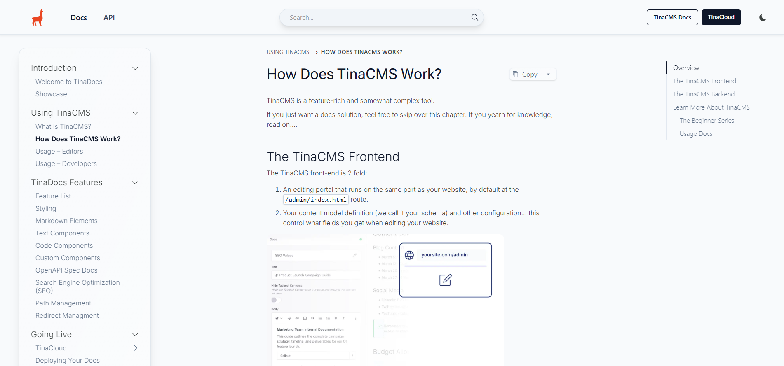
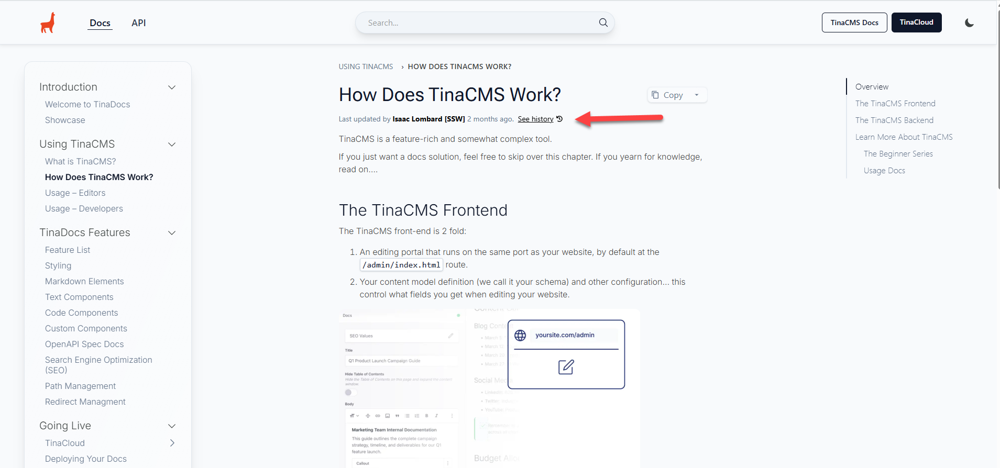

A website’s main purpose is to share information, promote products or services, and engage with its audience while building trust and credibility. Showing a “Last Updated By” label or a content history link adds transparency, assures visitors that content is maintained by real contributors, and reflects accountability and professionalism.

<!--endintro-->

::: bad  
  
:::

The example page explains how TinaCMS works, but users can’t tell whether the content reflects the latest version since recent updates or changes might not be apparent. Without this information, it’s hard to determine the authenticity or accuracy of the content.

::: good  
  
:::

In this example, the page shows that the content was last updated by Isaac two months ago, indicating that it’s still valid and reliable. This helps the audience understand how frequently the content is updated and assures them that the information is kept current. It also benefits maintainers by allowing them to see who made the latest changes directly on the site, without needing to open GitHub or check the page’s commit history.
