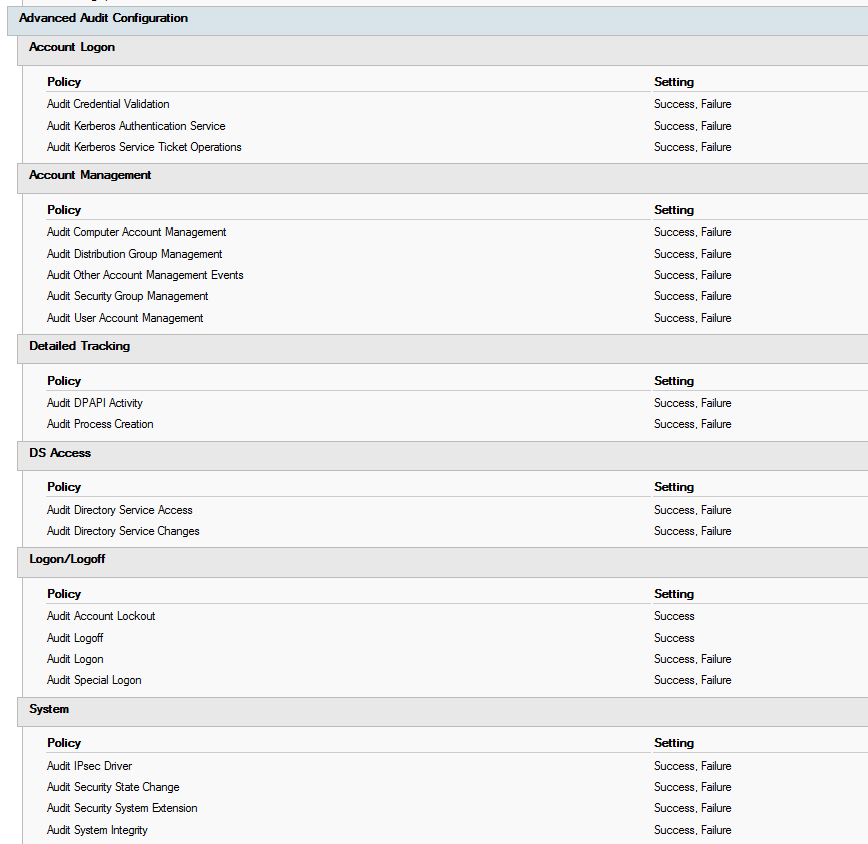

To detect and mitigate a cyber attack, the right set of events need to be collected from your domain controllers. The audit policy is a compromise between collecting too many and too few events. Logs are useful for detecting security events, but if there is too much noise, you'll miss the important information. 

<!--endintro-->

To enable advanced auditing on your domain controllers, use group policy. The settings are in **Computer Configuration | Windows Settings | Security Settings | Advanced Audit Policy Configuration | Audit Policies.**

adsecurity.org has great recommendations for what you should be auditing on your domain controllers (as well as a heap of other useful information!). Here is their list:

* Account Logon

  * Audit Credential Validation: Success & Failure
  * Audit Kerberos Authentication Service: Success & Failure
  * Audit Kerberos Service Ticket Operations: Success & Failure
* Account Management

  * Audit Computer Account Management: Success & Failure
  * Audit Other Account Management Events: Success & Failure
  * Audit Security Group Management: Success & Failure
  * Audit User Account Management: Success & Failure
* Detailed Tracking

  * Audit DPAPI Activity: Success & Failure
  * Audit Process Creation: Success & Failure
* DS Access

  * Audit Directory Service Access: Success & Failure
  * Audit Directory Service Changes: Success & Failure
* Logon and Logoff

  * Audit Account Lockout: Success
  * Audit Logoff: Success
  * Audit Logon: Success & Failure
  * Audit Special Logon: Success & Failure
* System

  * Audit IPsec Driver: Success & Failure
  * Audit Security State Change: Success & Failure
  * Audit Security System Extension: Success & Failure
  * Audit System Integrity : Success & Failure

:::good

:::

See the list in context, and more information here: https://adsecurity.org/?p=3377