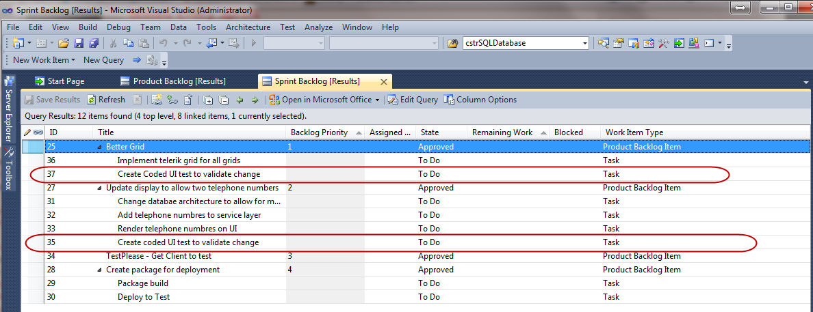

  
 What happens when you leave all the testing to the end of the sprint? You find things that are not <b><i>done</i></b> and you have no time before the <b>Sprint Review</b> to fix them. 

 <excerpt class='endintro'></excerpt> 

  

     <b>Figure: Bad example - if you don’t complete all the tasks the customer will not receive a build in the sprint</b> One way to mitigate this is to aim for a “<b><i>test please</i></b>” to occur a few days before the end of the <b>Sprint</b> but you still run the risk of not having enough time to make sure everything is <b><i>done.</i></b>  
 
 
<b>Figure: OK example – Send the “test please” before the end of the sprint so you have time to finish everything</b> 

It is preferable to conduct a <b>Smoke Test </b>to make sure that you are comfortable demoing the unit of work you just finished to the customer. One way to do this is to create a Coded UI test for each of the Stories as part of your Definition of Done (DoD) that runs through the functionality you have built. 

In this scenario the “<b>test please</b>” with the customer happens outside of the current Sprint.  
 
 
<b>Figure: Good example – Create a coded UI test for each story to prove that it is complete</b> 

If you are doing <b>Scrum</b> then you should have a <b>User Story</b> fleshed out with a set of <b>Acceptance Criteria</b>. These <b>Acceptance Criteria</b> are agreed with the <b>Product Owner</b> before <b>The Team</b> committed to the story, and define what the <b>Product Owner</b> will accept as complete. This makes it relatively easy to create some automated tests that test for these <b>Acceptance Criteria</b> and help your <b>Sprint Review</b> go as smoothly as possible. 

Any changes found during <b>the Sprint Review</b> get added to the <b>Product Backlog</b> to be prioritised by the <b>Product Owner</b>.  
 
 
<b class="ms-rteCustom-FigureGood">Figure: Ultimate example – Create a Test (could be Coded UI) for each of the Acceptance Criteria agreed with the Product Owner</b>

