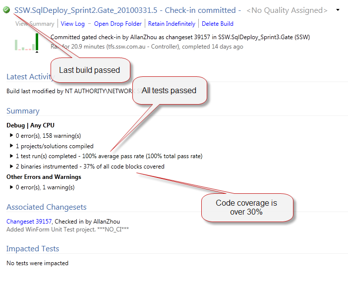

Most devs don't send 'Done' emails... Would you really expect Product Owners to always be checking Azure DevOps (was TFS) or GitHub?

The better approach is:

* If a task/bug came from a client when it is completed, send the 'Done' email to the Product Owner.
* If the task/bug is your breakdown of a PBI (that the developer did to break down a big User Story), then only send the ‘Done’ once the entire User Story is complete.

::: greybox
**Note:** Make sure that [every PBI has an owner](/tasks-do-you-know-that-every-user-story-should-have-an-owner) and send your 'done' to this person.
:::

::: greybox
**GitHub Note:** If you are using GitHub, you can close the issue with a comment, and @mention the people you wish to notify - GitHub will then email them for you, assuming they have [configured it correctly](/do-you-know-how-to-setup-github-notifications). This has the added bonus of being visible to everyone else who can see the issue, without needing to Cc everyone on your emails.
:::

### 'Done' tips

* Include the task #, summary, and link to the item in TWA
* Remember that all your tasks should be under 4 hours
* Follow the ['Done' email rules](/dones-do-you-reply-done-and-delete-the-original-email)
* If you completed the task in a different way than previously discussed, mention it.
* Make sure that every PBI has an Owner as per the rules.

<!--endintro-->

### If you are working on a task

When you complete a task that is part of a PBI you need to send a 'done' email to the owner of that User Story.

You only need to add the task #, summary and link to the item in WIWA. Remember that all your tasks should be [under 4 hours](/estimating-do-you-break-large-tasks-into-smaller-tasks). Spending lots of time on a 'Done' email for a Ttsk would be counter-productive. Add more information if required, for example you may have completed the task a different way than previously discussed.

### If you are the owner of a PBI

When the last task/bug of a PBI is complete, you then send a comprehensive 'Done' email when the story had been completed. Make sure you add a list of all of the Tasks that were completed as part of the story and the 'Done' criteria that you completed.

E.g.: Here is the [Definition of Done](/definition-of-done) we followed:

* Compiled/Built locally
* &gt;30% Code Coverage
* All unit tests passed

Then add an illustration to show this.

::: good  
  
:::

This is all designed to help you Scrum Team members (Product Owner, Scrum Master and Team) keep a certain quality bar on completion of each chunk of work. Remember that a task is not done until your team determines it is done.
