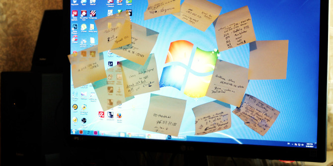
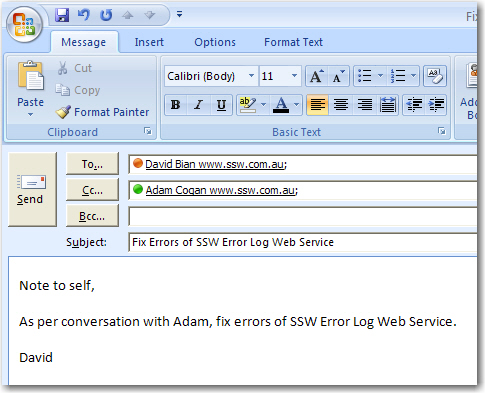
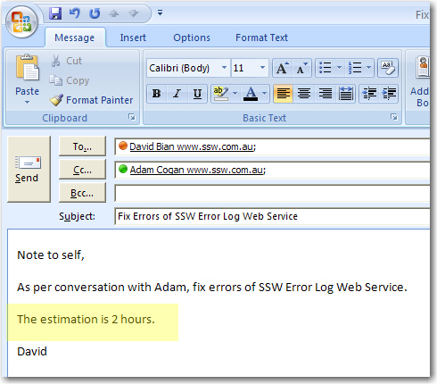

When a colleague or a client asks you to do a task verbally, or you have discovered there’s a task you need to do but don’t have time to do it immediately, what method do you have for remembering to do it? 

The best solution is to send yourself an email CC'ing the person who asked you, including "<a id="AsPerConversationEmail" href="/Pages/DoYouAlwaysSendAnAsPerOurConversationEmail.aspx" target="_blank" shape="rect">As per our conversation</a>..." This way both of you know that the job needs to be done. This is really important especially when you are working for clients so there is a record of the requests for work. 

 <excerpt class='endintro'></excerpt> 
<dl class="badImage"><dt>  </dt><dd>Figure: Writing yourself a "Post-It Note" is not the best method </dd></dl>
Always add "To myself" in the email body - not on the subject - so that other people CC'd know what is going on.  

 
      <b>From:</b> Jay Lin

 
      <b>To:</b> Jay Lin <b>Cc: </b>Adam Cogan, Lei Xu  <b></b>  <b>Subject: </b>Add bad example to Rules to Better UI -  Progress bar 

----------- 

      <b>To myself,</b> As per my conversation with Lei, the rule on progress bar is missing a bad example 

1. Add bad example to Rules to Better UI - progress bar - https://rules.ssw.com.au/long-process-do-you-show-the-status-of-progress-bar-on-winforms-title

Figure: Good Example - Send yourself an email, and make it clear to everyone else​​<h3>Tip: Include an estimate and priority too </h3>
When you write a "To Myself" email, it is even better when you include an estimate and the priority, so the expectations are set better.

With this estimate, the Product Owner can stop you if they think the amount of time doesn't provide good ROI. 
<dl class="badImage"><dt>  </dt><dd>Figure: Bad Example - Send a task to self without an estimate</dd></dl> <dl class="goodImage"> <dt>   
   </dt><dd>Figure: Good Example - Send a task to self with an estimate</dd></dl>

