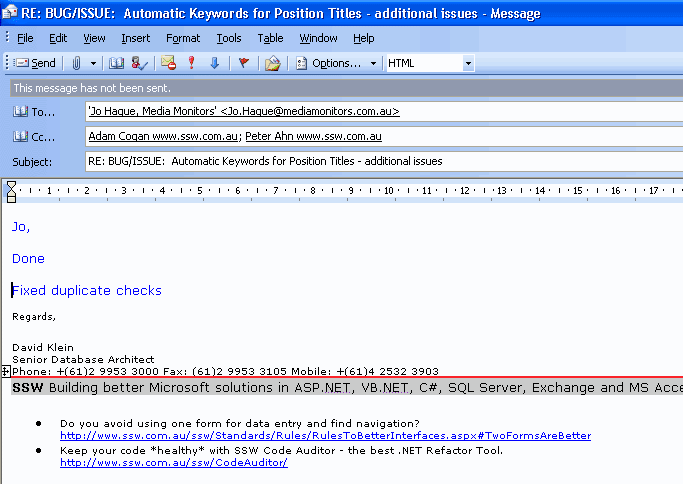
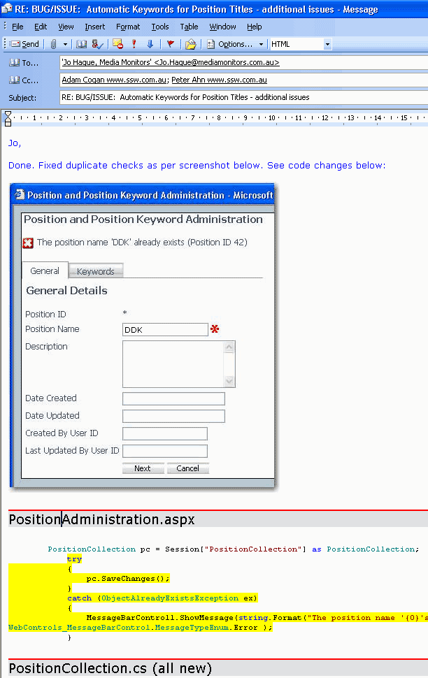
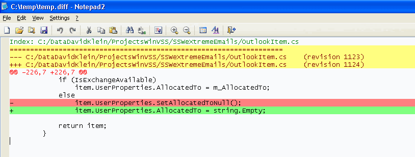

Including images is a good idea, in addition when appropriate include code snippets,  and ideally have the code that changed highlighted in yellow.

::: greybox
An email with just the word "done" can often be enhanced with a screen capture or code snippet...
...it provides evidence
...it educates
:::

<!--endintro-->

### Benefits 

This has several benefits:

* Improved visibility and transparency - The client can see the work actually being done
* Reduced cost of fixing a bug - the cost of a bug goes up based of the length of time taken for the client to ask for a change. If you tell a developer to change something he did today, it is many times cheaper for him to fix, than if he got the same request 2 months later (when he has forgotten was it was about)
* The client can raise questions based on what he sees in the code
* Finally, in the very unlikely case that the code repository and backup goes corrupt, your emails are a backup!

### Examples

Let's look at some examples and tips:

::: bad  
  
:::

::: good  
  
:::

### Tip 1: Include the URL 

If you are using TFS, you can also include a URL to the work item in TSWA.

### Tip 2: Include a .diff file

You can include the code as an attached text file.

::: good  
  
:::

### Tip 3: Force association between the code and the requirement 

For those developers lucky enough to be using Microsoft Team Foundation Server (TFS 2005, 2008 or 2010) you can associate your code changes with a work item. This means that future developers can work out not just \*what\* changed, but \*why\*. 
For those using TFS, enable the Checkin policy and force all developers to associate every check-in with a work item.

::: good  
  
:::

::: good  

:::
