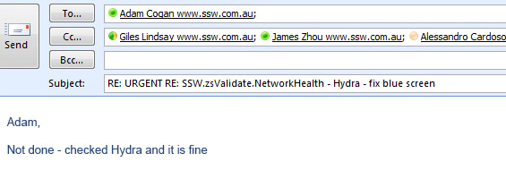
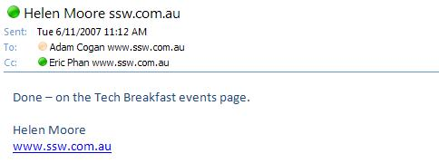
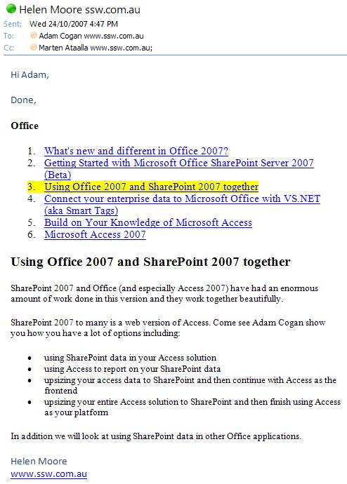

​​​​If someone asks you to perform a task by email, don't reply "OK, I will do that" or fail to reply at all. Instead, do the task and reply "Done" when the task has been completed, and then delete the email. This way the person requesting the task knows that it has been done, and doesn't waste time following you up.  

Read "<a title="Done Criteria" href="/_layouts/15/FIXUPREDIRECT.ASPX?WebId=3dfc0e07-e23a-4cbb-aac2-e778b71166a2&TermSetId=07da3ddf-0924-4cd2-a6d4-a4809ae20160&TermId=6449ae79-ba88-447e-aa48-36173029a2af" shape="rect">Definition of Done</a>" for more information about the steps that need to be finished before replying to a done email. 

 <excerpt class='endintro'></excerpt> 
<ul><li>If the task is already done, then reply "Already done - the reason is XXX".</li><li>If you don't agree with the task or are unable to complete the task, reply "Not done - the reason is XXX".</li><li>If there are multiple tasks that are Done and Not Done then, reply with "Partially done - the reason is XXX​" at the top of the email.</li></ul>

   <strong>Note 1</strong>: Only say done when the work is done. If you have added the email to your backlog or to-do list then instead of "Done", say "Added to backlog – URL is XXX​".​ 

 
   <b>Note 2: </b>For tasks that will take time to be completely done (E.g. Producing a video), you may send a "work in progress" email. This way you avoid giving the perception that no action was in relation to the​ task. 
<dl class="image"><dt>
      
   </dt><dd>Figure: Not Done Email </dd></dl><h3>Tip 1: Say "Done"​ first </h3>
For clarity, "Done", "Not done", or "Partially Done" should be the first word(s) so the reader knows the status straight away.​ 
<h3 class="ssw15-rteElement-H3">Tip 2: Provide Detail in your "Done"</h3>
In any reply, include relevant information, such as the URL and the code or text that has been updated, which allows the person requesting the work to check what was done and allows for offline reading.

 
   <a href="/Pages/HowToUseBalloons.aspx">Use SnagIt with Balloons in screenshots</a>.
<dl class="badImage"><dt>
      
   </dt><dd>Figure: Bad Example of a "Done" email.</dd></dl><dl class="goodImage"><dt>
      
   </dt><dd>Figure: Good Example of a "Done" email as it has both the link and the changed text.</dd></dl>
If you find that you have already sent a "Done", and then the client asks you to undo the change, reply "Undone". 
<h3 class="ssw15-rteElement-H3">Tip 3: Reply "Done" to multiple tasks</h3>
It is important that you reply correctly to emails with multiple tasks.

Hi Damian,  As per our conversation:  1. Change the logo on the SSW website to our new logo 2.Take a photo of you standing on your head  Bob 

<dd class="ssw15-rteElement-FigureNormal"> Figure: Original Email​ </dd>
Hi Bob,  I couldn’t find a camera so I haven’t done it all.  Damian 
<dd class="ssw15-rteElement-FigureBad"> Figure: Bad ​Example – It’s not clear which tasks have been done and which haven’t </dd>
Hi Bob,     &gt;Change the logo on the SSW website to our new logo Done. See <a href="http://www.ssw.com.au/">ssw.com.au</a>     &gt;Take a photo of you standing on your head Not Done. I couldn’t find a camera.  Damian 
<dd class="ssw15-rteElement-FigureGood"> Figure: Good Example – It is very clear which tasks have been done and which haven’t </dd>
Hi Bob,  1. Done (see <a href="http://www.ssw.com.au/">ssw.com.au</a>) 2. Not Done - We don't have a camera  Damian 
<dd class="ssw15-rteElement-FigureGood"> Figure: OK Example – It’s clear which tasks have been done and which haven’t, but you have to scroll to see what the tasks were​​ </dd>
Hi Bob,  I've replied inline in 
   red.  Damian  -------  Hi Damian,  As per our conversation:  1. Change the logo on the SSW website to our new logo.  Done - see <a href="http://www.ssw.com.au/">ssw.com.au</a>  2. Take a photo of you standing on your head.  Not Done - We don't have a camera   Bob 
<dd class="ssw15-rteElement-FigureGood">
 Figure: OK Example ​​​– It’s clear which tasks have been done, but we prefer not to reply inline
</dd>
Hi Bob,  1. Change the logo on the SSW website to our new logo. 2. Take a photo of you standing on your head.​ All Done   Damian 
<dd class="ssw15-rteElement-FigureGood">
 Figure: Good example – If multiple tasks are 'done' with no need for extra explanation, you can combine them. It’s clear that all tasks have been done​ </dd><h3 class="ssw15-rteElement-H3">Tip 4: Reply "Done" if you have a task that is &gt; 4 hours</h3>
Ideally, all tasks should be less than 4 hours. If you are given a task that is going to take days, then split it following the 
   <a href=/spec-do-you-create-tasks-under-4-hours shape="rect">4 hours rule</a>. 

 
   <strong>Q: </strong>What if you can do 8 out of 9 items? Can I reply "Done"?

 
   <strong>A: </strong>Yes. If there are multiple items of work in an email and you can't do them all at once (in say 4 hours), reply "Done" to each item individually, and put yourself in the TO: so you can go back and do the remaining items. 
   <a href=/dones-do-you-send-yourself-emails shape="rect">(See rule "To Myself")</a> 

Done - 8 out of 9 tasks.​ 

<h3 class="ssw15-rteElement-H3">Tip 5: Don't consolidate emails</h3>

If you get multiple emails or tasks, don't consolidate. It is still best to reply to each email individually as you go, rather than compile the information into one email. This way the person requesting the work hasn't <a href="/Pages/KeepEmailHistory.aspx" shape="rect">lost the email history</a> and can understand what the work is done relates to. It also means that testing and/or feedback can come in as soon as possible after the 1st completed task.

<h3 class="ssw15-rteElement-H3">Tip 6: Now Delete your email - Aim for 0 inbox</h3>

There is no point in keeping emails that just clutter your Inbox. You don't need to keep the original email because after you have replied "Done", there is a copy in "Sent Items". If you must keep an email, then move to your "Saved Items" folder. 

<h3 class="ssw15-rteElement-H3">Tip 7: Include URLs in screen captures</h3>

Screen captures should always include:

<ul><li>URL </li><li>Top-left area - so you can see what browser it is eg. Chrome or Edge</li></ul>
<h3 class="ssw15-rteElement-H3">Tip 8: When appropriate use text instead of an image​ </h3>

Done - There was a problem with the SQL. I added the line highlighted in​ Yellow: 
​ 
   <pre>SELECT ProdName = CASE WHEN Download.ProdCategoryID &lt;&gt; ''

THEN ProdCategory.CategoryName ELSE Download.ProdName END, Downloads = (SELECT Count(*) FROM ClientDiary WHERE ClientDiary.DownloadID = Download.DownloadID 

AND ClientDiary.CategoryID = 'DOWN' AND ClientDiary.DateCreated &gt; '01/01/2000' AND ClientDiary.DateCreated &lt; '01/01/2003') FROM Download LEFT JOIN ProdCategory 
ON Download.ProdCategoryID = ProdCategory.CategoryID    ​
​
ORDER By Downloads DESC​</pre>
<dd class="ssw15-rteElement-FigureGood"> 
 Figure: Good example - Most of the time screens need images. However, this "DONE" uses text instead of an image. It is easier to search and easy to reply with a modification​​ 
</dd><h3 class="ssw15-rteElement-H3">Tip 9: Handle an email once</h3>

Follow a tip I got from my accounting days... "A sign of an efficient person is they handle a piece of paper once". When you get an email - don't just open it, have a quick look and close it with the idea that you will go back to it later. Read it, make a decision and do the action. Delete as many emails as you can on the first go.

<h3 class="ssw15-rteElement-H3">Tip 10: Use an Email tool for Outlook</h3>

We use a program called Team Companion that you can use to reply "Done" to tasks in TFS. See more information on this at 
   <a href=/dones-do-you-reply-done-using-team-companion-when-using-tfs>Dones - Do you reply 'Done' using Team Companion when using TFS?</a>

<h3 class="ssw15-rteElement-H3">Tip 11: Consider alternatives in a team environment</h3>

In a development team environment, it is better to move emails to bug tracking systems e.g.:

<ol><li> 
      <a href="http://www.ssw.com.au/ssw/Standards/Rules/RulesToBetterProjectManagementWithTFS.aspx" shape="rect">TFS Work Items </a></li><li> 
      <a href=/rules-to-better-jira shape="rect">JIRA</a> </li></ol>
<h3 class="ssw15-rteElement-H3">Tip 12: Include a video when appropriate</h3>

Record a quick and dirty "<a href=/record-a-quick-and-dirty-done-video>Done Video</a>"

 
   <strong>VIDEO</strong> - <a href="https://www.youtube.com/watch?v=LAqRokqq4jI">Top 10+ Rules to Better Email Communication with Ulysses Maclaren</a> 

<h3 class="ssw15-rteElement-H3">Tip 13: Remember to thank people - don't be too brief and icy </h3>

When replying 'Done' for a bug or issue someone reported, remember to thank the person for taking the time to send it. A short "Thank you for reporting this" helps to make your 'Done' warmer.​  

