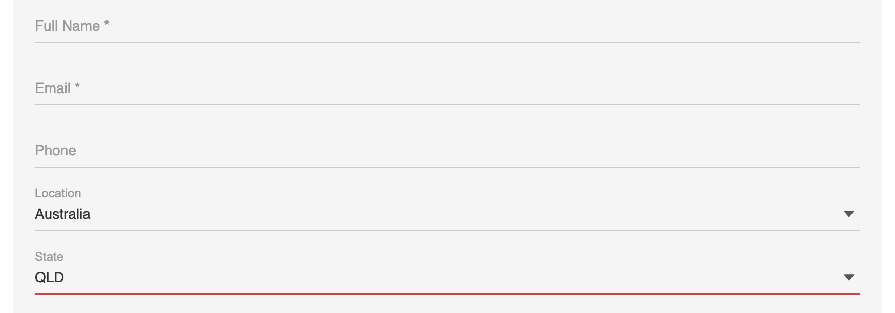

If someone asks you to perform a task by email, don't reply "OK, I will do that" or fail to reply at all. Instead, do the task and reply "<mark>Done</mark>" when the task has been completed, and then delete the email. This way the person requesting the task knows that it has been done, and doesn't waste time following you up.

Read "[Definition of Done](https://www.ssw.com.au/rules/done-do-you-go-beyond-done-and-follow-a-definition-of-done)" for more information about the steps that need to be finished before replying to a done email.

<!--endintro-->

::: greybox
**Only say "Done" when the work is completed.**

- If you have added the email to your backlog or to-do list, then say "<mark>Added to backlog – URL is XXX</mark>". You should still reply "Done" when you complete the task.

- For tasks that will take time to be completely done (E.g. Producing a long video), you may send a "work in progress" email. This way you avoid giving the perception that no action was in relation to the task. You should still reply "Done" when you complete the task.
:::

### When no work is needed

* If the task is already done, then reply "<mark>Already done - the reason is XXX</mark>"
* If you don't agree with the task or are unable to complete the task, reply "<mark>Not done - the reason is XXX</mark>"
* If there are multiple tasks that are Done and Not Done then, reply with "<mark>Partially done - the reason is XXX</mark>"

::: email-template  
|          |     |
| -------- | --- |
| To:      | Jason |
| Subject: | RE: Northwind - Include one more field to the form |  
::: email-content  

### Hi Jason,  
Not done - checked with Northwind and they're happy with the form as it is.

:::  
:::  
::: good  
Figure: Good Example - "Not Done" email
:::

### Tips for your "Done" emails

#### Tip 1: Say "Done" first

For clarity, "Done" (or "Not done" / "Already Done" / "Partially Done") should be the first word(s) so the reader knows the status straight away.

### Tip 2: Provide details in your "Done"

In any reply, include relevant information, such as URLs, screenshots, and pieces of code/text that have been updated. This allows others to check what was done straight away.

::: greybox
Extra tip: Read [Screenshots - Do you use balloons instead of a 'Wall of Text'?](https://rules.ssw.com.au/screenshots-do-you-use-balloons-instead-of-a-wall-of-text).
:::

::: email-template  
|          |     |
| -------- | --- |
| To:      | Jason |
| Subject: | RE: Northwind - Include one more field to the form |  
::: email-content  

### Hi Jason,  
Done on the contact page

:::  
:::  
::: bad  
Figure: Bad Example - "Done" email lacks of details
:::

::: email-template  
|          |     |
| -------- | --- |
| To:      | Jason |
| Subject: | RE: Northwind - Include one more field to the form |  
::: email-content  

### Hi Jason,  
Done - added "State" field to the contact form - northwind.com/contact 

  ::: good  
    
  :::

:::  
:::  
::: good  
Figure: Good Example - "Done" email has a link and a screenshot
:::

### Tip 3: Reply "Done" to multiple tasks

It is important that you clearly reply to each of the multiple tasks.

::: email-template  
|          |     |
| -------- | --- |
| To:      | Jason |
| Subject: | Northwind website - Update logo + add a photo |  
::: email-content  

### Hi Jason,  
As per our conversation,

1. Update the logo on Northwind website the new logo
2. Take a photo of the office façade and add to the "About Us" page

Bob

:::  
:::  
**Figure: Original Email** 


::: email-template  
|          |     |
| -------- | --- |
| To:      | Bob |
| Subject: | RE: Northwind website - Update logo + add a photo |  
::: email-content  

### Hi Bob,  
Hi Bob,

I couldn’t find a camera so I haven’t taken the photo

Jason
:::  
:::
::: bad
Figure: Bad Example – It’s not clear which tasks have been done and which haven’t  
:::

::: email-template  
|          |     |
| -------- | --- |
| To:      | Bob |
| Subject: | RE: Northwind website - Update logo + add a photo |  
::: email-content  

### Hi Bob,  
Hi Bob,

1. Done - See northwind.com 
2. Not Done - I couldn’t find a camera.

Jason

:::  
:::
::: ok
Figure: OK Example – It’s clear which tasks have been done and which haven’t, but you have to scroll to the original email to know what the tasks were 
:::

::: email-template  
|          |     |
| -------- | --- |
| To:      | Bob |
| Subject: | RE: Northwind website - Update logo + add a photo |  
::: email-content  

### Hi Bob,  
Hi Bob,

   &gt;1. Update the logo on Northwind website the new logo
Done - See northwind.com 

   &gt;2. Take a photo of the office façade and add to the "About Us" page
Not Done - I couldn’t find a camera.

Jason

:::  
:::
::: good
Figure: Good Example – It is very clear which tasks have been done and which haven’t  
:::

----
::: todo
Tiago: Improved Markdown and examples until here! Below still to be fixed
:::

::: greybox
Hi Bob,

I've replied inline in     red.

Damian

-------

Hi Damian,

As per our conversation:

1. Change the logo on the SSW website to our new logo. 
Done - see [ssw.com.au](http://www.ssw.com.au/)

2. Take a photo of you standing on your head. 
Not Done - We don't have a camera 

Bob

:::


::: good
Figure: OK Example – It’s clear which tasks have been done, but we prefer not to reply inline  
:::


::: greybox
Hi Bob,

1. Change the logo on the SSW website to our new logo.
2. Take a photo of you standing on your head.
All Done 

Damian

:::


::: good
Figure: Good example – If multiple tasks are 'done' with no need for extra explanation, you can combine them. It’s clear that all tasks have been done

:::

### Tip 4: Reply "Done" if you have a task that is &gt; 4 hours

Ideally, all tasks should be less than 4 hours. If you are given a task that is going to take days, then split it following the     [4 hours rule](/spec-do-you-create-tasks-under-4-hours).

**Q:** What if you can do 8 out of 9 items? Can I reply "Done"?

**A:** Yes. If there are multiple items of work in an email and you can't do them all at once (in say 4 hours), reply "Done" to each item individually, and put yourself in the TO: so you can go back and do the remaining items.     [(See rule "To Myself")](/dones-do-you-send-yourself-emails)


::: greybox
Done - 8 out of 9 tasks.

:::


### Tip 5: Don't consolidate emails

If you get multiple emails or tasks, don't consolidate. It is still best to reply to each email individually as you go, rather than compile the information into one email. This way the person requesting the work hasn't [lost the email history](/do-you-keep-the-history-of-an-email) and can understand what the work is done relates to. It also means that testing and/or feedback can come in as soon as possible after the 1st completed task.

### Tip 6: Now Delete your email - Aim for 0 inbox

There is no point in keeping emails that just clutter your Inbox. You don't need to keep the original email because after you have replied "Done", there is a copy in "Sent Items". If you must keep an email, then move to your "Saved Items" folder.

### Tip 7: Include URLs in screen captures

Screen captures should always include:

* URL
* Top-left area - so you can see what browser it is eg. Chrome or Edge


### Tip 8: When appropriate use text instead of an image


::: greybox

Done - There was a problem with the SQL. I added the line highlighted in <font style="background-color:#ffff00;">Yellow</font>:


```
SELECT
ProdName = CASE WHEN Download.ProdCategoryID <> ''

THEN ProdCategory.CategoryName
ELSE Download.ProdName END,
Downloads = (SELECT Count(*) FROM ClientDiary
WHERE ClientDiary.DownloadID = Download.DownloadID 

AND ClientDiary.CategoryID = 'DOWN'
AND ClientDiary.DateCreated > '01/01/2000'
AND ClientDiary.DateCreated < '01/01/2003')
FROM
Download
LEFT JOIN ProdCategory 
ON Download.ProdCategoryID = ProdCategory.CategoryID    

ORDER By Downloads DESC
```


:::


::: good
Figure: Good example - Most of the time screens need images. However, this "DONE" uses text instead of an image. It is easier to search and easy to reply with a modification  
:::

### Tip 9: Handle an email once

Follow a tip I got from my accounting days... "A sign of an efficient person is they handle a piece of paper once". When you get an email - don't just open it, have a quick look and close it with the idea that you will go back to it later. Read it, make a decision and do the action. Delete as many emails as you can on the first go.

### Tip 10: Use an Email tool for Outlook

We use a program called Team Companion that you can use to reply "Done" to tasks in TFS. See more information on this at     [Dones - Do you reply 'Done' using Team Companion when using TFS?](/dones-do-you-reply-done-using-team-companion-when-using-tfs)

### Tip 11: Consider alternatives in a team environment

In a development team environment, it is better to move emails to bug tracking systems e.g.:

1. [TFS Work Items](http://www.ssw.com.au/ssw/Standards/Rules/RulesToBetterProjectManagementWithTFS.aspx)
2. [JIRA](/rules-to-better-jira)


### Tip 12: Include a video when appropriate

Record a quick and dirty "[Done Video](/record-a-quick-and-dirty-done-video)"

**VIDEO** - [Top 10+ Rules to Better Email Communication with Ulysses Maclaren](https://www.youtube.com/watch?v=LAqRokqq4jI)

### Tip 13: Remember to thank people - don't be too brief and icy

When replying 'Done' for a bug or issue someone reported, remember to thank the person for taking the time to send it. A short "Thank you for reporting this" helps to make your 'Done' warmer.

### Tip 14: Undoing tasks

If you find that you have already sent a "Done", and then the client asks you to undo the change, reply "Undone".
