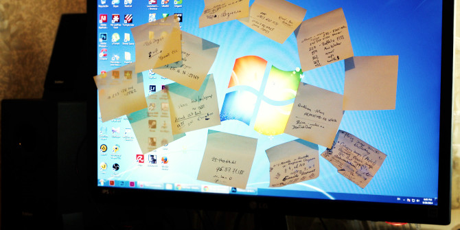

When a colleague or a client asks you to do a task verbally, or you have discovered there’s a task you need to do but don’t have time to do it immediately, what method do you have for remembering to do it?

<!--endintro-->

The best solution is to send yourself an email CC'ing the person who asked you, including "[As per our conversation](/do-you-send-as-per-our-conversation-emails)..." This way both of you know that the job needs to be done. This is really important especially when you are working for clients so there is a record of the requests for work.

**Note:** If the request is relevant to client work or an existing Product Backlog then it would be better to create or update a PBI and @ mention the Product Owner and relevant people as per the rule [do you use @ mentions in pbi](https://www.ssw.com.au/rules/when-you-use-mentions-in-a-pbi).

::: bad  
  
:::

::: greybox
**Tips:**

- **Make it clearer to everyone else by making "To myself" a heading or bold**
  Always add "To myself" in the email body - not on the subject - so that other people CC'd know what is going on. More information: [Do you include the name of the  person you address as a heading?](/do-you-include-the-name-of-the-person-you-address-on-the-first-line)

- **Include an estimate and priority too**  
  When you write a "To myself" email, it is even better when you include an estimate and the priority, so the expectations are set better.
  With this estimate, the Product Owner can stop you if they think the amount of time doesn't provide good ROI.
:::

::: email-template  
|          |     |
| -------- | --- |
| From:    | John |
| To:      | John |
| Cc:      | Adam, Uly, Lei |
| Subject: | Add bad example to Rules to Better UI -  Progress bar |  
::: email-content  

**To myself,**  

As per my conversation with Lei, the rule on progress bars \[link\] is missing a bad example

1. Add a bad example to Rules to Better UI - progress bar  

It's estimated to take **2 hours** and I'll make it my #1 priority on the next Sprint, starting tomorrow

:::  
:::  
::: good  
Figure: Good Example - Send yourself an email with estimate and prioritization
:::
