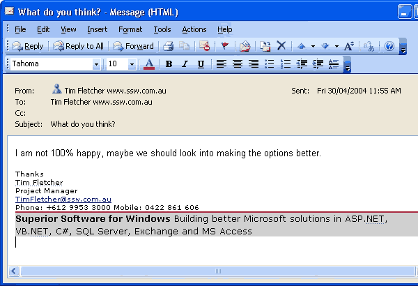
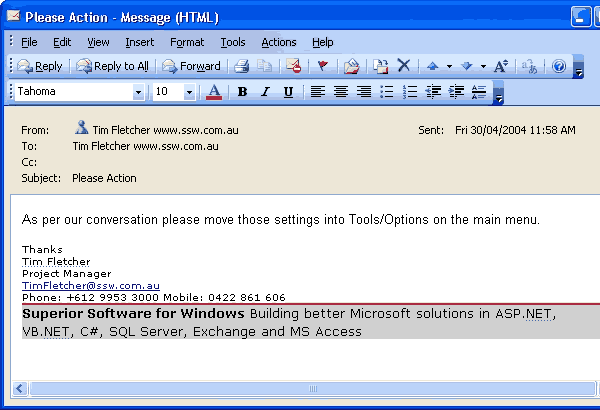

Email is a very powerful business tool. The main problem, however, is that for most people it is out of control - emails build up until they are impossible to manage. To help minimize mailbox clutter, try these tips: 

<!--endintro-->

* Send emails that contain clear tasks, not banter
* If an email you receive is not clear, phone the sender and ask for clarification, then document it in a follow-up email “As per our conversation…”. Too many people reply by email asking for more information, which wastes time and does not guarantee a response.
* If you speak to them, follow this rule: [Do you Seek Clarification Via the Telephone First](/Pages/SeekClarificationViaTelephoneFirst.aspx)
* If you can't get through, follow this rule: [Do you chase your Manager or does he have to chase you?](/do-you-chase-your-manager-before-he-has-to-chase-you-e-g-asking-for-clarification)

Using your mailbox as a task list also saves you from having to use inefficient paper-based cards to track your tasks.
  Figure: Bad Example - A bad email is one that gives no clear action items and will probably lead to a back and forth thread (potentially with people misunderstanding each other)  Figure: Good Example - A good email has a clear next step action point 
**Tip 1:** It is better when email is not used as communication. Of course, if the person is unavailable, follow the ‘[as per our conversation](/Pages/DoYouAlwaysSendAnAsPerOurConversationEmail.aspx)’ rule which tells you what to do.

E.g. "As per the message I left on your phone…" and detail the questions you would like answered.

**Tip 2:** Make sure to number your tasks, if there is more than one, as per "[Do you number small tasks related to 1 topic](/Pages/NumberSmallTasks.aspx)?"

**VIDEO** - [Top 10+ Rules to Better Email Communication with Ulysses Maclaren](https://www.youtube.com/watch?v=LAqRokqq4jI)
