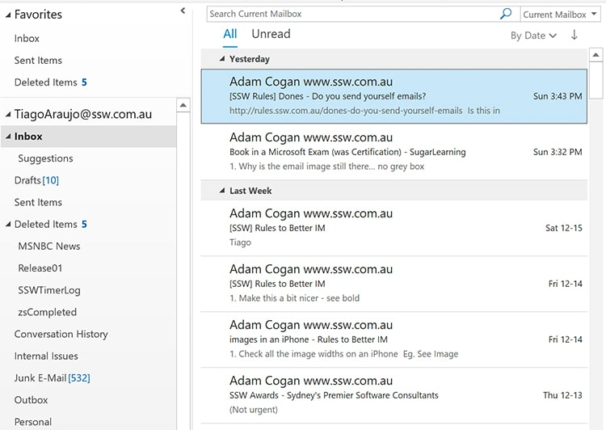

​Most people don’t manage their inbox effectively. Emails should be treated as a list to do. As you complete a task you can just delete the email. 

 <excerpt class='endintro'></excerpt> 

Your inbox should only contain 'tasks', that are actionable items on your <strong>list of things to do</strong>. Everything that is in your 'Inbox' (including sub-folders) should only be to-do items.

So do it now, delete all emails you have done. If you want to keep some for reference, move them to a new folder that is not in your inbox. 
<dl class="image"><dt> </dt><dd>Figure: All inbox items are tasks</dd></dl>
In fact, you could go so far as to say you should not do anything unless you have an email telling you to do it (which is why we <a href=/dones-do-you-send-yourself-emails>send ourselves emails</a>). However, very simple tasks can be requested and replied 'done' via IM. 

​​Read <a href=/rules-to-better-im>Rules to Better IM</a>.​ 

