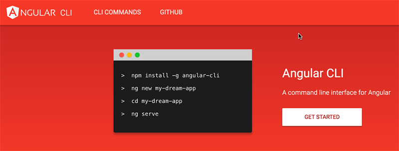

​
<a href="http://angular.io/" target="_blank">Angular.io​</a> is a great place to get started learning Angular, and since the Angular CLI is now an official Angular project, these docs now include using the CLI from the beginning.

 <excerpt class='endintro'></excerpt> 

The <a href="https://angular.io/docs/ts/latest/quickstart.html">Quick Start</a> and <a href="https://angular.io/docs/ts/latest/tutorial/" target="_blank">Tour of Heros Tutorial</a> will teach you lots about Angular.

For an enterprise real-world project you should also consider:
<ol><li>
      <b>Whether your application will require the redux pattern ​</b> See <a href=/use-ngrx-on-complex-applications>Do you know to use ngrx on complex applications? </a>  </li><li>
      <b>Do you need a UI framework?</b>  See <a href="/_layouts/15/FIXUPREDIRECT.ASPX?WebId=3dfc0e07-e23a-4cbb-aac2-e778b71166a2&TermSetId=07da3ddf-0924-4cd2-a6d4-a4809ae20160&TermId=1c35f4c4-7f94-4c88-8bbf-a81dfc77f5d7">Do you know the best UI framework for Angular? </a> </li></ol>
 

There are also several well-used templates that incorporate Angular and server-side tooling. While these starters often include advanced functionality, we prefer to implement pure Angular CLI projects where possible because Angular updates frequently.. and when you are using someone else's template that incorporates Angular you are left with the options of waiting for them to update their template to the latest version of Angular, or working out how to do it yourself. This can often leave you with large amounts of work or be being several months behind the latest versions. 

To learn how to build <strong>enterprise Angular applications</strong> check out <a href="http://firebootcamp.com/angular2">FireBootCamp</a> 
<dl class="goodImage"><dt>  </dt><dd>Figure: Good Example: The Angular CLI will create you a new Angular project with a single command, and that project will be set up with production build, unit testing, and end-to-end testing all configured. If you have very specific build requirements, the CLI also supports custom web pack builds.  </dd></dl>

