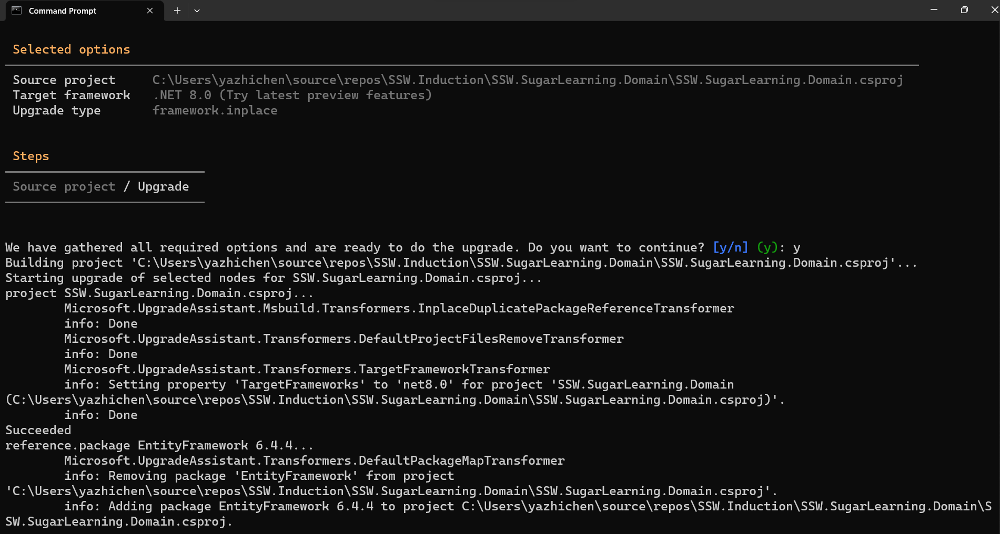

With outdated NuGet packages, C# stylings and architectures, keeping our .NET Framework applications up to date can be a pain. Especially when we want to make the leap from .NET Framework to .NET for that juicy performance and compatibility bump.

Luckily Microsoft provides excellent tooling for supporting your great leap into .NET. The best part? It's free and Open Source! 

The [.NET Upgrade Assistant](https://dotnet.microsoft.com/en-us/platform/upgrade-assistant) is a .NET global tool that helps you incrementally upgrade your .NET Framework-based Windows applications. It's available on [GitHub](https://github.com/dotnet/upgrade-assistant) as a public repository.

<!--endintro-->
# ✅ Benefits

+ Stay agile - Receive immediate feedback on your migration progress
+ Guided steps - Get the recommended steps for upgrading your application and action them as you see fit
+ Multiple project types and languages - Receive support for project types including:
   - ASP.NET MVC
   - Windows Forms
   - Windows Presentation Foundation
   - Console
   - Libraries
   - UWP to Windows App SDK (WinUI)
   - Xamarin.Forms to .NET MAUI
+ Extensible - Customize the .NET Upgrade Assistant as you see fit
+ Open Source - Contribute features and bugfixes to help others achieve the same goal
+ Upgrading to modern .NET - Provides more opportunity for the future of your application

# ❌ Downsides

+ Generic - the .NET Upgrade Assistant tries its best to be generic, and therefore may not be able to identify and work with your proprietary NuGet packages. Those dependencies will need to be upgraded separately, or an alternative needs to be found.
+ Time consuming - While the .NET Upgrade Assistant does well to reduce the time and cost of upgrading your .NET applications, it will still take a significant amount of time, especially on live projects.

If your project is overly complex or encounters significant challenges with .NET 8 Upgrade Assistant, 
you may need to revert to the original project and then continue with the instructions in the rule [Do you know how to handle complex .NET migrations?](https://www.ssw.com.au/rules/dotnet-upgrade-for-complex-projects/)
