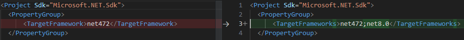

There's not 1 single thing that makes a .NET project complex to migrate to the latest .NET Framework. Generally though it's a combination of the following:

- High complexity
- Lots of .NET Framework dependencies
- Outdated NuGet packages with no modern alternatives
- etc.

If your project doesn't meet any of the above criteria, you should consider using the [.NET Upgrade Assistant](https://dotnet.microsoft.com/en-us/platform/upgrade-assistant). You can read more about the tool at [Do you know how to modernize your .NET applications?](https://www.ssw.com.au/rules/dotnet-upgrade-assistant/) If the .NET Upgrade Assistant works for your project, you could save a significant amount of time. However, the level of success may vary across different projects.

While complex .NET migration has many steps and can be time-consuming, it offers significant benefits, including incremental migrations, improved risk management, and streamlined progress tracking.

The migration begins with an Evolutionary approach and then smoothly transitions to the Strangler Fig pattern, optimizing the advantages of both approaches. The Evolutionary approach ensures better compatibility with .NET 8 for the existing code, while the Strangler Fig pattern complete the full migration.

This strategy results in a codebase that functions within the old .NET Framework while progressively moving towards .NET 8. The majority of changes bring benefits to both platforms, allowing seamless deployment of these improvements to production. You can get more information about different migration approaches at [Do you know the different ways to modernize your application?](https://www.ssw.com.au/rules/modernize-your-app/)

Below you will find some tips and tricks to help you with your more complex migrations.

<!--endintro-->

# Preparation

### Upgrade the projects to use the sdk style csproj format

You can use the [try-convert](https://github.com/dotnet/try-convert) dotnet tool to convert your projects to the new sdk style csproj format. This will make it easier to upgrade the projects to the latest .NET Framework.

Install the tool using

```bash
dotnet tool install -g try-convert
```

Upgrade your web projects using

```bash
try-convert --keep-current-tfms --force-web-conversion
```

and your other projects using

```bash
try-convert --keep-current-tfms
```

### Change all your projects to be able to target multiple Target framework monikers (TFM)

In all your project files change the `TargetFramework` to `TargetFrameworks`. You want to do this early on to enable a smoother flow later to not need unload and reload projects or have to close and reopen Visual Studio.

What this will allow you to do is add your target framework and compile the code. This will allow you to see what code is not compatible with the new framework and fix those issues while still developing/deploying your project in the current target framework.

```csharp
<TargetFrameworks>net472;net8.0</TargetFrameworks>
```



# Upgrading

At this point, ensure your project can target both the .NET Framework and the new target .NET. Some of the projects might not support both platforms right away and you can follow these steps to fix the issues and have a better understanding of how much work it might lies ahead.

1. Add the target framework to your project
2. Compile to see what breaks
3. Fix what is easy to fix
   1. Remember to commit after each fix to help your reviewers 😉
4. Anything that is not easy to fix, create a PBI with details of the issue
   1. This allows another developer on your team to work on that PBI independently
5. If you have a project that is able to compile at this point you can leave the new TFM in your project and continue to the next project
   1. If not, you can remove the new TFM and continue to the next project
   2. Repeat these steps once the PBIs have been completed related to this project

Outlined below are rules designed to assist in the project upgrade process during migration. Please note that the applicability of certain rules may vary based on individual project requirements.

- [Do you know how to migrate from System.Web to modern alternatives?](https://www.ssw.com.au/rules/migrate-from-system-web-to-modern-alternatives/)
- [Do you know how to migrate from EDMX to EF Core?](https://www.ssw.com.au/rules/migrate-from-edmx-to-ef-core/)

# Web application

There are several ways to migrate project from ASP.NET to ASP.NET Core. We strongly recommend using the Strangler Fig pattern to incrementally migrate your project with [YARP](https://microsoft.github.io/reverse-proxy/).

### Create side-by-side incremental project with [.NET Upgrade Assistant](https://dotnet.microsoft.com/en-us/platform/upgrade-assistant)

This will create a new .NET 8 project. For functionalities that have not yet been migrated, YARP will redirect them to the .NET Framework web application.

### Configure YARP

```csharp
var webRoutes = new List<RouteConfig>
{
    // Route for token
    new()
    {
        RouteId = "tokenServePath",
        ClusterId = tokenClusterId,
        Match = new RouteMatch
        {
            Path = "/token/{**catch-all}",
        },
    },

    // Route for WebUI App
    new RouteConfig
    {
        RouteId = "webUIServePath",
        ClusterId = webUiClusterId,
        Match = new RouteMatch
        {
            Path = "/api/v2/{**catch-all}",
        },
    },

    // Route for WebApp App
    new RouteConfig
    {
        RouteId = "webAppServePath",
        ClusterId = webAppClusterId,
        Match = new RouteMatch
        {
            Path = "/api/{**catch-all}",
        },
    },

    // Route for Angular
    new RouteConfig
    {
        RouteId = "angularUIServePath",
        ClusterId = angularClusterId,
        Match = new RouteMatch
        {
            Path = "{**catch-all}",
        },
    }
};

```

**Figure: Example code for setting up different paths within YARP's configuration.**

### Upgrading components using Upgrade Assistant

Once you have created the side-by-side project, select the project that needs migration and `right click` | `Upgrade` on it.


**Figure: Context menu on the project to be migrated.**

Upgrade Assistant will show you a Summary view and detect that the project is linked to your Yarp proxy.
You can also see the migration progress of your endpoints from .NET Framework to .NET as a pie chart.


**Figure: Upgrade Assistants Summary page.**

From here you can explore your endpoints through the `Endpoint explorer`, which will also indicate what endpoints have already been migrated and which ones are still outstanding.
The chain icon  indicates that this endpoint has been migrated and is linked between
the controller in the old project and the controller in the Yarp proxy project.


**Figure: Endpoint Explorer showing the endoints between the old .NET Framework project and the new .NET Core project.**

Use the `Upgrade` functionality to aplly automatic code transformations and speed up the migration process.
In the best-case scenario, the controller has been fully ported across and does not require any manual work.
In most scenarios, you will need to review the controller and update any custom code that the Upgrade Assistant could not automatically transform.


**Figure: Upgrade Assistant progress upgrading a controller.**

### Create PBIs to identify the upcoming tasks

When a web project is heavily reliant on .NET Framework dependencies, the first step in gauging the effort required for a complete migration is to thoroughly examine these dependencies. This involves a detailed investigation, followed by the creation of PBIs for each dependency. These PBIs serve to accurately scope out the total effort that will be needed for the migration process.

Listed below are rules crafted to aid in the project migration process. Please ensure to incorporate only those rules that are applicable to your specific project.

- [Do you know how to migrate Global.asax to ASP.NET Core?](https://www.ssw.com.au/rules/know-how-to-migrate-global-asax-to-asp-net-core/)
- [Do you know how to migrate OWIN to ASP.NET Core?](https://www.ssw.com.au/rules/know-how-to-migrate-owin-to-asp-net-core/)
- [Do you know how to migrate Web.config to ASP.NET Core?](https://www.ssw.com.au/rules/know-how-to-migrate-owin-to-asp-net-core/)

# .NET Upgrade Assistant

By now, you should have wrapped up the entire migration including the web applications. It's the perfect moment to use the .NET Upgrade Assistant. It'll guide you in cleaning up the codebase. The ultimate goal is to eliminate all the old .NET Framework components and keep only the code and the most up-to-date NuGet packages for .NET 8.
