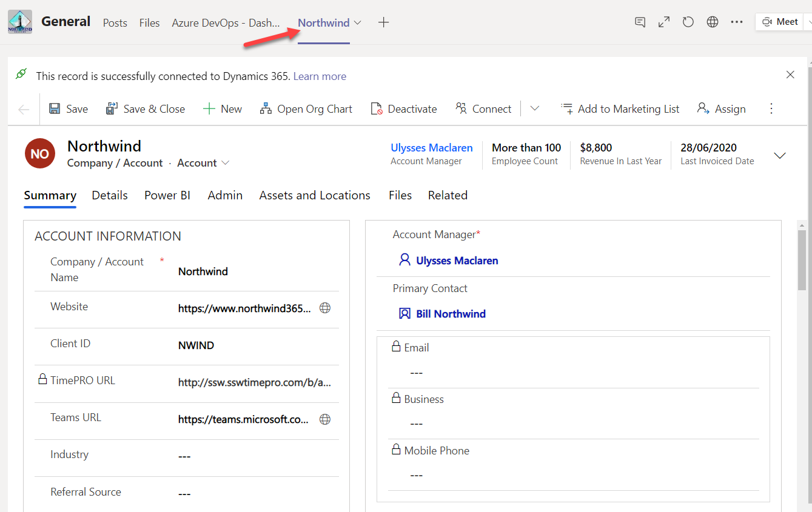

<ul><li>​In Teams, add a Dynamics tab </li><li>In Dynamics, add a Teams URL field </li></ul>
 <excerpt class='endintro'></excerpt> 
<dl class="image"><dt>​</dt><dd>Figure: Dynamics 365 tab in MS Teams (also showing the Teams URL field, two birds in one stone)</dd></dl><h3 class="ssw15-rteElement-H3">​Related r​ules​​ </h3>

<ul><li><a>Do you know where to keep your files?</a></li><li><a href="/_layouts/15/FIXUPREDIRECT.ASPX?WebId=3dfc0e07-e23a-4cbb-aac2-e778b71166a2&TermSetId=07da3ddf-0924-4cd2-a6d4-a4809ae20160&TermId=c34a016c-d126-4e10-859e-4a0bbd2f08a6">​Do you store project documents in Teams?</a> </li></ul>

