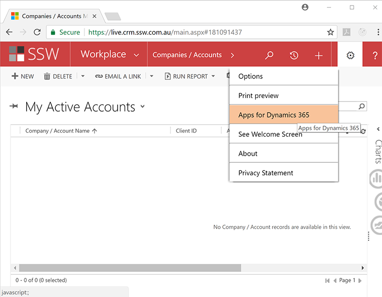
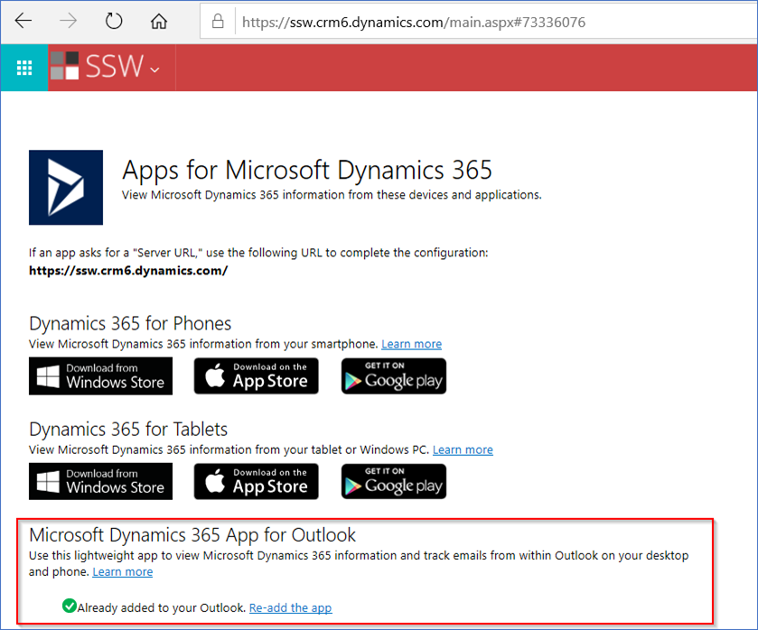
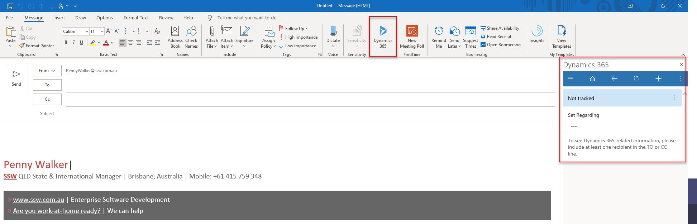

You should install the new Dynamics 365 App for Outlook to track your appointments, booking leave and developers for projects.

<!--endintro-->

### Pre-requisites

1. On your PC, install [Office 365](http://portal.office.com/)
2. On your mobile phone, install the Outlook app
3. [Set up your CRM mailbox](/set-up-your-mailbox-in-crm)

### Install the Dynamics 365 App for Outlook

Follow these steps:

1. Open a new tab and navigate to your CRM. E.g. At SSW, it is [ssw.crm6.com](https://ssw.crm6.dynamics.com/main.aspx?app=d365default&forceUCI=1)
2. Select Settings (cog) | Advanced Settings
3. Select Settings (cog) | Apps For Dynamics 365

  

4. Install the App.
From this page, you should have the option to Download Dynamics 365 for Outlook and then follow the prompts to finish the configuration.
You can optionally install the new App (ask your SysAdmin for help if you're unable to get it working)

  

5. You should now see the Dynamics 365 plugins available within Outlook (e.g. emails & appointments)

   

Now you can get up-and-running using CRM:

* [Scheduling - Do you know how to book developers for a project?](/scheduling-do-you-know-how-to-book-developers-for-a-project)
* [Sales - Do you track all sales-related activities in CRM?](/sales-do-you-track-all-sales-related-activities-in-crm)
