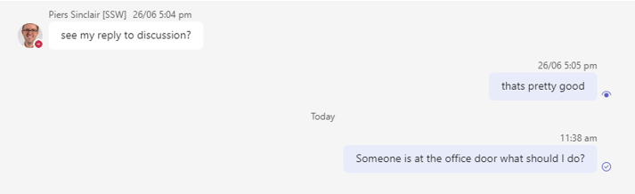
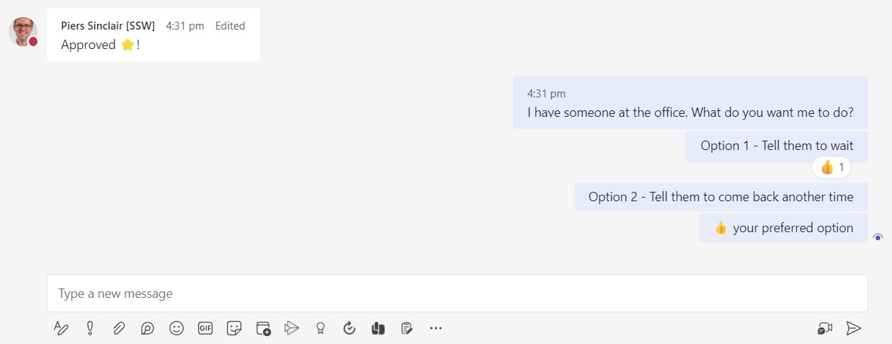
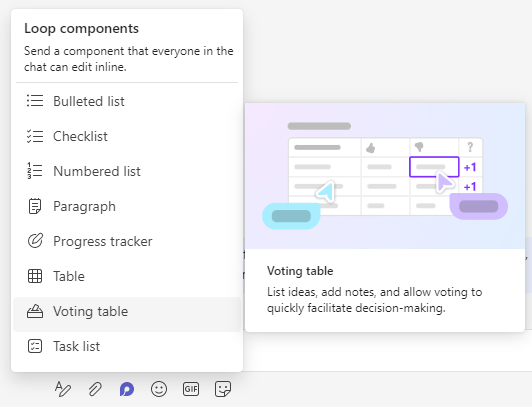
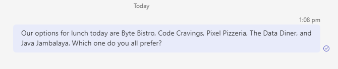
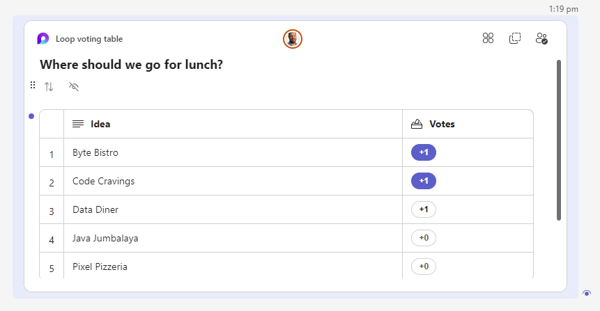
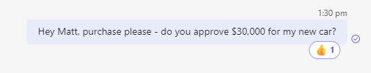
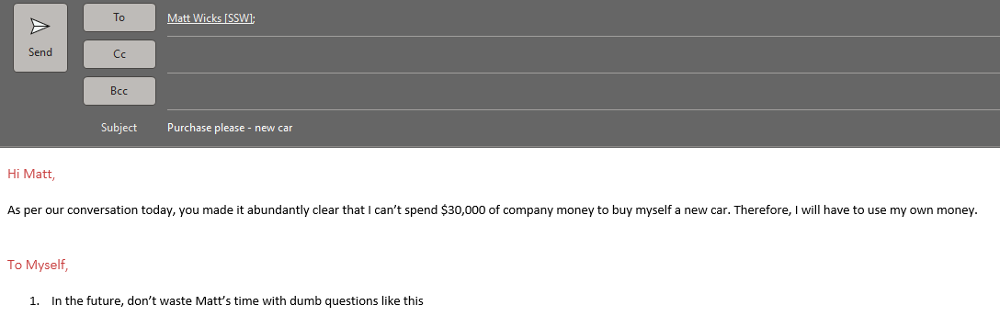

Do you sometimes spend time answering unnecessarily complicated questions? This can be a pain and cost valuable time. Or, when you're asking someone a question about something that is blocking you, do you ever get frustrated when the person reads your message but doesn't reply? This can lead to a series of reminders and time spent chasing them up.

Asking easy questions saves time for both the person asking and the person answering, and gets to the decision as quick as possible.

<!--endintro-->

# Make your questions easy to respond to

If you need an answer quickly, you should aim to make as easy as possible for the other person to respond. Where possible, avoid open ended questions as they take more time and effort to reply to. The easier it is for the other person to respond, the quicker and more effective your communication will be. Therefore, you should always aim for the simplest way you can phrase your question without losing the important points. Depending on your question, you should approach asking it differently - make sure that the way you ask the question matches the level of importance and complexity. Don't ask for a $10,000 purchase please with a Teams message!

### Yes or no

This type of question is the easiest to answer. The clearest way to phrase it is with a 'y or n' at the end of your question.

::: greybox
What do you think of this caption for our new video on Facebook?
:::

::: bad
Figure: Bad example - open ended question
:::

::: greybox
Is this caption good for our new video on Facebook? Y or n?
:::

::: good
Figure: Good example - the other person knows immediately how to answer
:::

Tip: Don't feel like you are confining their reply - if they feel like they need to add more detail, they can!

### Simple questions

For a simple question with multiple options, list the options and ask them to thumbs up 👍 their preferred one. That makes it as simple as possible to respond so you can even catch people who are extremely busy!

### Questions to a group

When you anticipate many replies/votes to your question (e.g. in a group chat), use polls. In Microsoft Teams, use the 'Voting Table' Loop component. Polls help to reduce noise and easily analyze responses.

::: img-large  

:::

::: bad

:::

::: good

:::

### When you need a paper trail

If it will be important to have a record of your discussion, the best thing to do is call or have an in-person discussion. Once you have the answer, send an [as per our conversation email](/as-per-our-conversation-emails/) to make sure both parties are clear on the result.

::: bad

:::

::: good

:::
