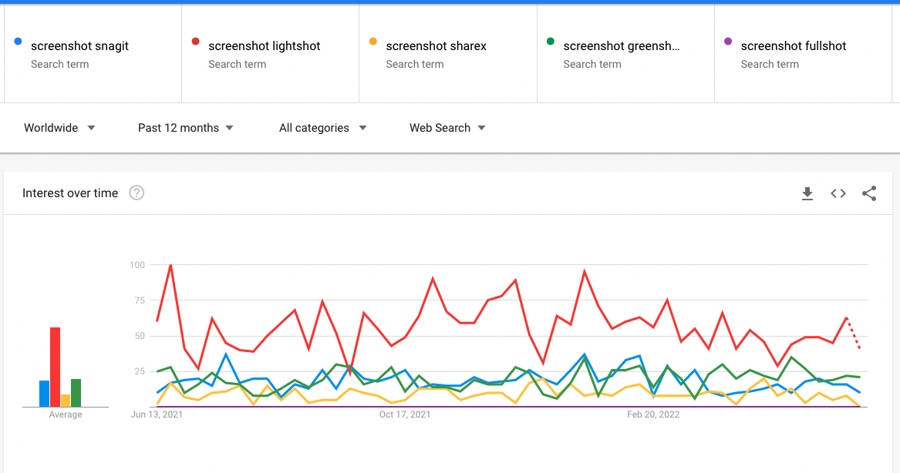

A picture says a thousand words so it is important to provide context with screenshots. However, it isn't always clear what part of the screenshot you need to be looking at. So, it is important that you edit your screenshots to add extra info such as highlighting critical information.

Windows provides a default tool for taking and editing screenshots called the Snipping Tool. However, it is quite limited in functionality. For example, it doesn't provide the ability to draw a box quickly and easily on the screenshot.

<!--endintro-->

## Tools

There are heaps of great tools that provide much more advanced functionality. The best tools are

* [Snagit](https://www.techsmith.com/screen-capture.html) - Gold Standard ⭐
* [ShareX](https://getsharex.com/)
* [Preview](https://support.apple.com/en-au/guide/preview/welcome/mac)
* [Greenshot](https://getgreenshot.org/)
* [Lightshot](https://app.prntscr.com/en/index.html)
* [Fullshot](http://www.inbit.com/downloadfullshot.html)

::: bad

:::

::: good

:::

::: good

:::

::: good

:::