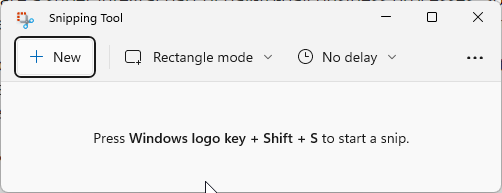
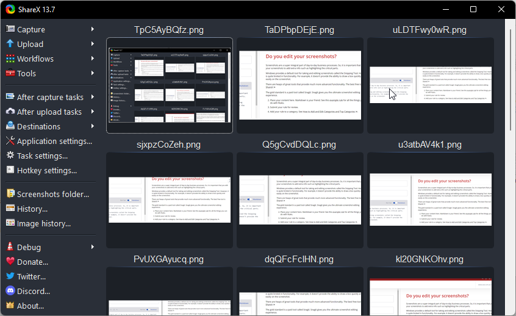
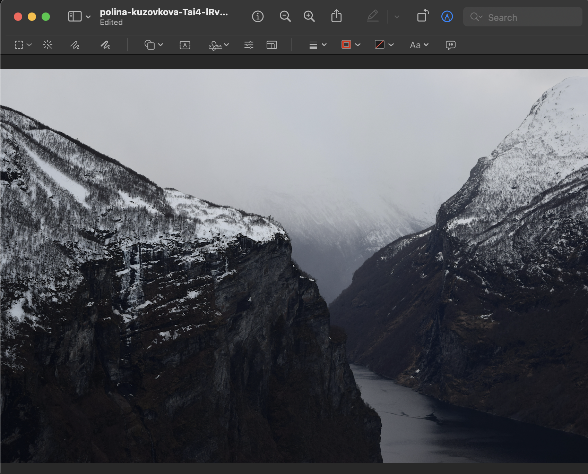
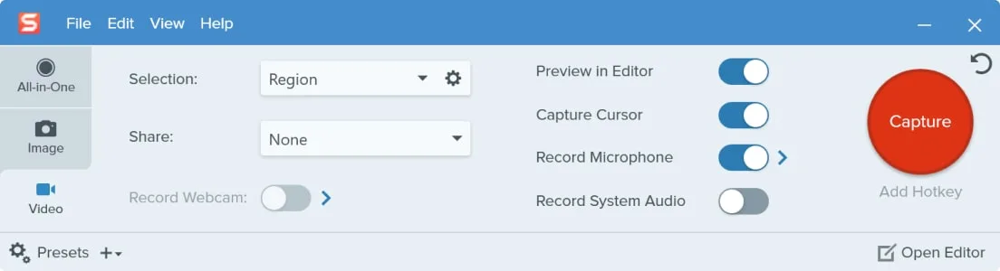

Screenshots are a super integral part of day-to-day business processes. So, it is important that you edit your screenshots to add extra info such as highlighting critical information.

Windows provides a default tool for taking and editing screenshots called the Snipping Tool. However, it is quite limited in functionality. For example, it doesn't provide the ability to draw a box quickly and easily on the screenshot.

<!--endintro-->

There are heaps of great tools that provide much more advanced functionality. The best free tools are

* Windows - [ShareX](https://getsharex.com/)
* Mac - [Preview](https://support.apple.com/en-au/guide/preview/welcome/mac)

The gold standard is a paid tool called [Snagit](https://www.techsmith.com/screen-capture.html)

Snagit gives you the ultimate screenshot editing experience and works for both Mac and Windows

::: bad

:::

::: good

:::

::: good

:::

::: good

:::