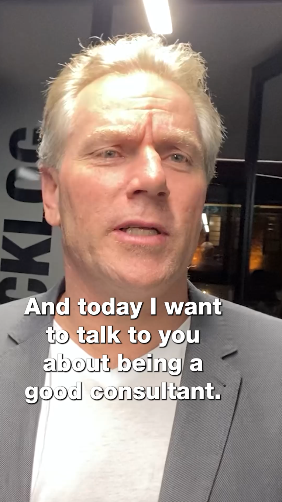

TikTok is a great way to engage with your audience via social media. TikTok is a more fun, informal, and relaxed social media platform compared to the likes of YouTube, Facebook, LinkedIn etc. It allows for a different style of creative freedom and spontaneity in your videos.

However, to effectively engage with your audience, it is important to format and edit your videos following editing best practices that are optimised for TikTok.  Doing this will ensure your videos are noticed exactly by whom and how you intended them to be seen.

## Tip 1 - TikTok video length

TikTok videos can be as short as 2 seconds to a maximum of 10 minutes.  The most effective TikTok videos range from 15 seconds to 3 mins. Here are some of the most-watched TikTok videos of all time:

- [Zach King's Harry Potter illusion - 2.2 billion views (18 sec)](https://www.tiktok.com/@zachking/video/6768504823336815877?is_from_webapp=1&sender_device=pc)
- [James Charles' Christmas wonderland transition - 1.7 billion views (15 sec)](https://www.tiktok.com/@jamescharles/video/6768188988441332998?is_from_webapp=1&sender_device=pc)
- [Khaby Lame's 'How to open a car door' video - 350 million views (25 sec)](https://www.tiktok.com/@khaby.lame/video/6979606181463526661?is_from_webapp=1&sender_device=pc)
- [Boss reacts to case in the box (30sec)](https://www.tiktok.com/@tofutech/video/7082371662452165889?is_from_webapp=1&sender_device=pc)

While creators are able to make longer videos, the above video lengths suggest that around 20 seconds is perfect.

Source: https://danslee.co.uk/2020/01/21/clipped-i-watched-the-100-best-tiktok-videos-to-find-the-optimum-length-of-a-clip/

## Tip 2 - TikTok Music: Can I add music to my TikTok Video?

- Yes - If it's your unique music
- Yes (not recommended) - If it's “copyright free” or “free for-profit” music, then technically you can use it. However, it might come with complications. This is due to it being very hard to find truly copyright free music - there is almost always a copyright attached to a work.
- No - If it’s someone else’s song you desire to upload which isn’t already on the TikTok library

TikTok has a solid copyright policy, and they use a AI to enforce it. If any content material in the video is auto-detected as copyrighted, the audio in the video could be muted, or the platform may prohibit the video from being uploaded altogether.

If you've got the necessary license to use the music in the video, then you can file a counter-notification via the link below and supply papers proving that the correct rights to use the music was purchased.

TikTok: <https://www.tiktok.com/legal/copyright-policy?lang=en>

Your safest option is to only use sounds and music that is already on TikTok, unless you own it. If you’re a verified business, you're only permitted to use TikTok's royalty-free music under their updated policy. But don't worry - it is very common to not upload any music at all and just have the unique dialogue and sounds from your original video itself.

Fun Fact, the most popular music genre used on TikTok is Hip-Hop/Rap making up for about 60% of the pie!

## Tip 3 - TikTok captions

Captions are an excellent way to open your TikTok videos to a broader audience. They increase a video's general accessibility, prompting more users to like your content. Users might include:

- Commuters or those in a general loud area
- The deaf or hearing impaired
- Learning disabilities
- Attention deficit disorder
- Autism

**Top 5 reasons for including captions:**

1. Improve average watch time: Captions hold the attention more of the viewer
2. SEO: Backing up your video with captions and a transcript of the audio helps you rank on Google
3. Accessibility: As mentioned above, it makes your content more accessible to people who may have a disability or learning difficulty
4. 4. User experience: Studies show users find more clarity in the content when captions are included
5. Helping ESL Learners: Captions and subtitles makes it easier for non-native English speakers to understand and comprehend your message

When you allow captions for every video you make, the sound no longer becomes a necessity for the video to give value.

## Tip 4 - TikTok Orientation - Vertical or horizontal?

The best orientation for recording is vertical. However, you can also record horizontal and then reframe and crop it to a vertical export for TikTok. You might do this if you want to post the same video to both YouTube and TikTok.

## Tip 5 - TikTok overlay reference guide

You should use an overlay reference guide when editing TikTok videos. This allows the editor to ensure the videos are formatted correctly, keeping in mind TikTok’s User Interface. Once the video is ready to export, you can turn off the guideline layer. See below images:

Relevant link: [Adam Cogan Blog](Tech World on TikTok - Is it for you?)
