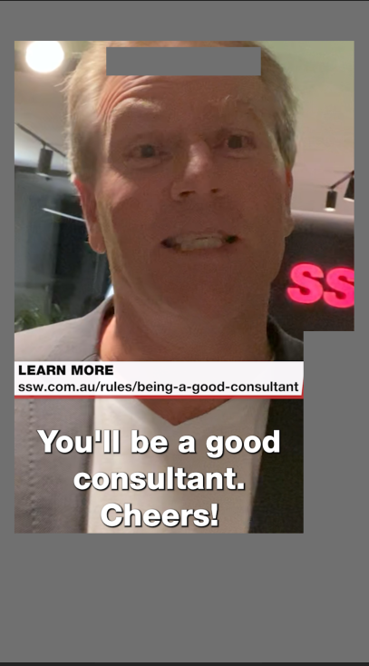

TikTok is a great way to engage with your audience via social media. TikTok is a more fun, informal, and relaxed social media platform compared to the likes of YouTube, Facebook, LinkedIn etc. It allows for a different style of creative freedom and spontaneity in your videos.

However, to effectively engage with your audience, it is important to format and edit your videos following editing best practices that are optimised for TikTok.  Doing this will ensure your videos are noticed exactly by whom and how you intended them to be seen.

## TikTok video length

TikTok videos can be anywhere as short as 2 seconds to a maximum of 10 minutes.  The most effective TikTok videos range from 15 seconds to 3 mins. Here are some of the most-watched TikTok videos of all time:

1. [Zach King's Harry Potter illusion - 2.2 billion views](https://www.tiktok.com/@zachking/video/6768504823336815877?is_from_webapp=1&sender_device=pc)
2. [James Charles' Christmas wonderland transition - 1.7 billion views](https://www.tiktok.com/@jamescharles/video/6768188988441332998?is_from_webapp=1&sender_device=pc)
3. [Khaby Lame's 'How to open a car door' video - 350 million views](https://www.tiktok.com/@khaby.lame/video/6979606181463526661?is_from_webapp=1&sender_device=pc)
4. [Boss reacts to case in the box](https://www.tiktok.com/@tofutech/video/7082371662452165889?is_from_webapp=1&sender_device=pc)

While creators are able to make longer video the optimum length would appear to be shorter.

Source: https://danslee.co.uk/2020/01/21/clipped-i-watched-the-100-best-tiktok-videos-to-find-the-optimum-length-of-a-clip/

## Can I add music to my TikTok Video?

- If it's your unique music, then yes
- If it's “copyright free” or “free for-profit” music, technically yes but presumably steer clear. This is due to it being very hard to search for truly copyright free music and there is almost always a copyright attached to a work.
- If it’s someone else’s song you desire to upload which isn’t already on the TikTok library, then definitely no.

Because of the copyright policy for TikTok, if any content material in the video is auto-detected as copyrighted music by their system, the audio in the video could be muted, or the platform may prohibit the video from being uploaded altogether.

If you got the necessary license to use the music in the video, simply file a counter-notification via the link underneath to supply papers proving that the right rights to use the copyrighted job in your video got been purchased.

TikTok: <https://www.tiktok.com/legal/copyright-policy?lang=en>

Your safest bet would be to only use sounds and music that is already on TikTok, despite uploading your own. If you’re a verified business on TikTok, remember that you're only permitted to use their royalty-free music under their updated policy. It is very common to not upload any music at all and just have the unique dialogue and sounds from your original video itself.

Fun Fact, here are the most used music genres for TikTok videos

## Why use captions for TikTok videos?

Captions are an excellent way to open your TikTok videos to a broader audience. They increase a video's general accessibility, prompting more users to like your content. Users incluude:

- Commuting or those in a general loud area.
- The deaf or hearing impaired
- Learning disabilities
- Attention deficit disorder
- Autism

### Top 5 reasons for including captions:

1. Accessibility: As mentioned above, it makes your content more accessible.
2. SEO: Backing up your video with captions and a transcript of the audio helps you rank on Google.
3. User experience: Studies show users find more clarity in the content when captions are included.
4. Helping ESL Learners: Captions and subtitles makes it easier for non-native English speakers understand and comprehend your message. Improve average
5. Improve average watch time: Captions hold the attention more of the viewer.

When you allow captions for every video you make, the sound no longer becomes a necessity for the video to give value.

## TikTok reference guidelines when editing

The best standard for recording is vertical. However, you can also record horizontal and then reframe and crop accordingly to a vertical export for TikTok. The reason why you might do this is so you can post to both YouTube and TikTok.

SSW TV uses an overlay reference guide when editing our TikTok videos. This allows us to ensure our videos are formatted correctly keeping in mind TikTok’s User Interface. Once ready to export our video, we turn off the guideline layer. See below images:

