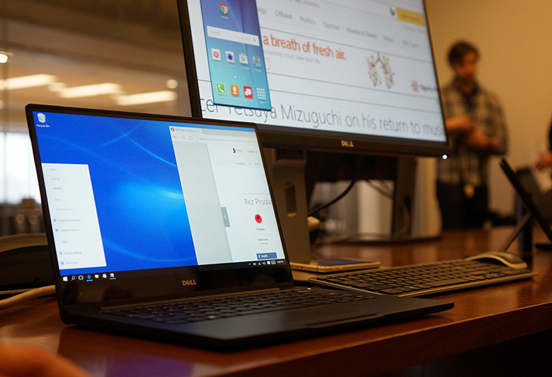

Studies have shown that you can get **up to a 30% increase in productivity** by using more than one monitor when you work.

<!--endintro-->

Providing users with the ability to access more information and images simultaneously, multiple monitor configurations allow for more efficient multitasking between applications.

For example... if you were a developer, you could have your references in one monitor and your Visual Studio in another, and directly compare the 2 without compromising on space or layout.

::: good  
  
:::
