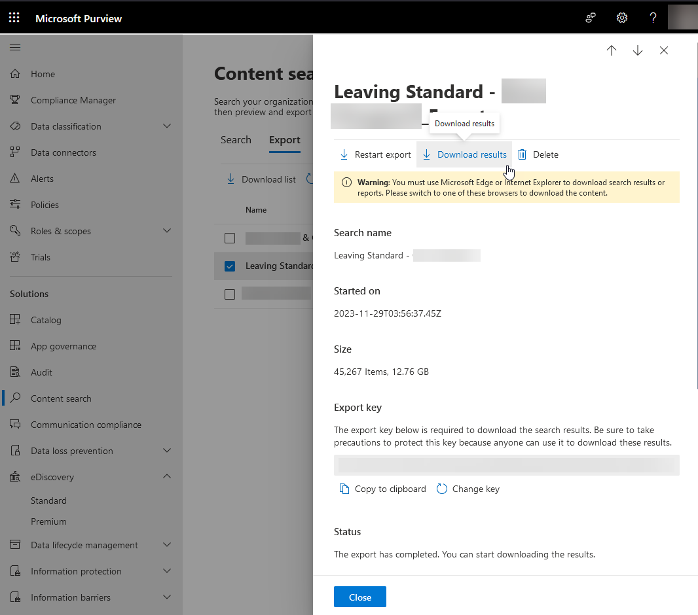
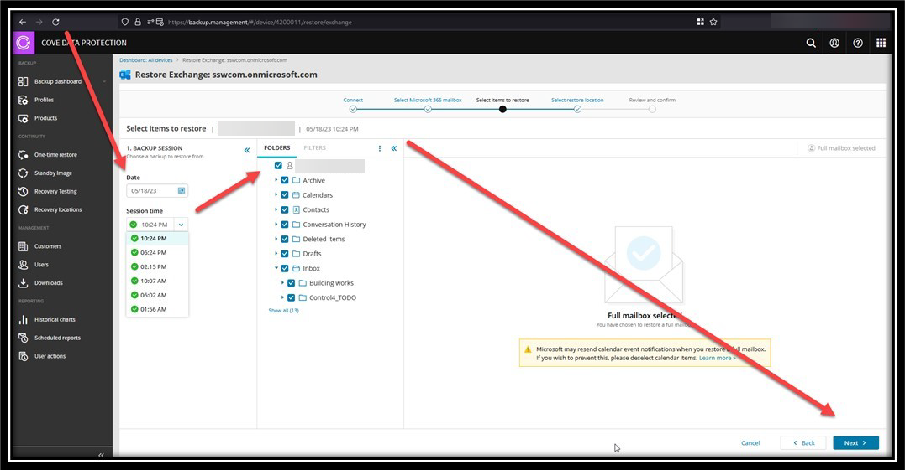

In today's digital landscape, the importance of robust email backup solutions cannot be overstated. Regular and efficient backups are essential, not just when an employee departs from the company, but on a daily basis to ensure data integrity and continuity. If you are using Microsoft's Exchange Online solution for your emails, these are some options for you.

<!--endintro-->

### Exporting PSTs Manually via Microsoft Purview

Waiting until an employee leaves the company and then manually exporting their PST files to a file server is inefficient and risky. This method is time-consuming, prone to errors, and does not guarantee data integrity or easy accessibility.
While [Microsoft Purview's Compliance center](https://compliance.microsoft.com/contentsearchv2) is good and allows you to export and search a lot, it's not the recommended way to back up your emails.

::: bad

:::

### Using a 3rd party Backup Solution

For reliable and efficient email backups, several third-party solutions are available in the market. Here are some notable options:

- N-Able by Cove Data Protection (Recommended): Offers comprehensive backup options for Exchange, SharePoint, and OneDrive. N-Able allows for efficient data backup and easy restoration with just a few clicks, ensuring high data protection and accessibility.

::: good

:::

Other notable options:

- Veeam Backup for Microsoft Office 365: Provides secure backup for Office 365 data, including emails, with quick recovery options. It ensures that you have access to your email data in case of accidental deletion, security threats, or retention policy gaps.
- Acronis Cyber Protect: Known for its integration of backup with cybersecurity, Acronis Cyber Protect offers not only backup solutions for emails but also advanced security features to protect against malware and phishing attacks.
- Barracuda Cloud-to-Cloud Backup: Specializes in protecting data in cloud environments. Barracuda offers comprehensive backup and recovery solutions for emails in Office 365, providing protection against data loss and downtime.
