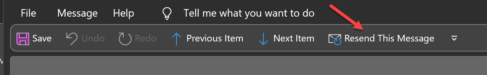

Sometimes you will need to send a new version for an email. This often is due to 2 main reasons:
  - You **received substantial feedback** about the email you've sent that requires a new version
  - You realized you've **made a mistake** and want to send an updated version of an email

<!--endintro-->

Having an entire new version of an email is important as it:
   - Ensures that you understood feedback and incorporated it immediately
   - Cleans up the email thread history to only have relevant content

`youtube: https://www.youtube.com/embed/SUo_hOCubeo`
**Video: Fixing An Email Mistake with [Adam Cogan](https://www.ssw.com.au/people/adam-cogan/) (3 min)** 

::: greybox
**Note:** Not every feedback will need a v2. Some may be in the form of:
  - Hints for what could be better for next time, in which case all that's required is you take the feedback on board
  - Changes or clarifications to the content, that can act as the latest version of the thread, without needing a re-send
:::

### How to send a v2 (Outlook)

1. Open your v1 email in Sent Items
2. Click Actions | Resend this message
3. Include (v2 - {{ REASON }}) on the first line of the email body  

::: info
**Warning:** Do not add "v2" to the subject as we want to keep the thread.
:::

4. If the email is a reply, then [keep the email history](/do-you-keep-the-history-of-an-email) leading up to your original email. 
5. Replace your v1 with your v2 email, as if the v1 never happened (same for v3, v4, etc)

::: greybox
**Note:** For v3 emails replace the (v2 - {{ REASON }}) on the first line of the email body with (v3 - {{ REASON }}). Repeat this for v4, v5, etc. 

For appointments, the procedure is different, see [do you explain why you've updated or deleted an appointment?](/explain-deleted-or-modified-appointments).
:::

::: email-template  
|          |     |
| -------- | --- |
| To:      | Bob |
::: email-content  

(v2 - {{ REASON }})

### Hi Bob,  

{{ EMAIL CONTENT }}

Regards,  
Dave

:::  
:::  
::: good  
Figure: Good example - Sending a 'v2' when you need to make an update
:::

::: greybox
**Note:** If all the feedback you received is incorporated into the new version, there is no need for an additional done email. However, if you've got other tasks in the feedback, it may be necessary to reply 'done' to those separated from the content of your v2.
:::

::: greybox
**Tip:** If you are doing a lot of these, you can add the 'Resend This Message' button to 'Quick Access' toolbar in Outlook.

:::

`youtube: https://www.youtube.com/embed/2WoDQBhJCVQ`
**Video: Some jobs give no chance for a v2**
