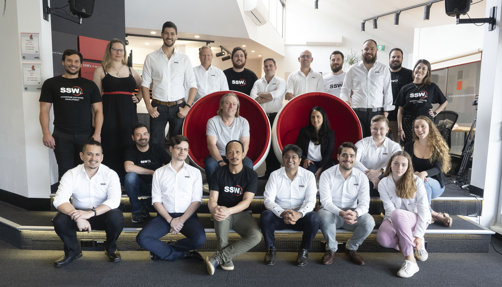

Your people are a huge part of what makes your company awesome or unique, so you should use this to your advantage by asking them to be your walking spokespersons and/or billboards. Branding your employees is especially important at events such as conferences, user groups and client meetings. A simple way to do this is to wear branded shirts or t-shirts every day.

If you wear a collard shirt, your corporate uniform should be simple and stylish - don't forget that your branding can be subtle and effective at the same time.

Also remember that uniforms don't have to be boring or uncomfortable, but they do need to represent who you are as a company. If you decided to do something fun, pop culture t-shirts are always a popular choice, particularly at conferences, but you should take great care to make sure that the message aligns with your corporate image. If you nail this, your employees will love to wear your t-shirts to work and out in the general community, adding to your exposure.

<!--endintro-->

::: good

:::

::: good

:::

Of course, another great way of promoting your company via your staff is on their social media accounts. You can encourage your staff to update their social media bio's to include their role and the company they work for, plus the website if there are enough characters for it.
Wherever your employees gather in large numbers, ensure they come branded.

::: good
Figure: Good Example - Your employee profile on social media can also be branded

:::