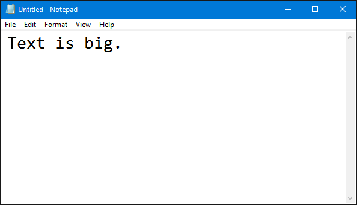
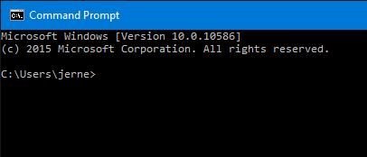

<!--endintro-->

### Visual Studio

When presenting to an audience using visual studio it is important to alter a few things for the best possible experience for the audience.

First of all, you need to make your font bigger. This is probably rule number one. There's nothing worse than not being able to see the excellent code you're trying to demo.

Remember to increase the font of your Environment, as well as of the Text Editor.

Secondly, you need to remove any distracting panes or other windows. These usually just get in the way. If you really need them, make sure they're set to pin mode, so they hide when not in use.

Most importantly, you can have all these things done for you at the click of a button by using the 
   [presentation mode extension by Mads](https://devblogs.microsoft.com/visualstudio/use-visual-studio-in-presentation-mode/).

`youtube: https://www.youtube.com/embed/7wMJIYz9lvU`

::: bad

:::

::: good

:::

### Text Editor

Change font size in your text editor.

::: bad

:::

::: good

:::

### Command Prompt

And don't forget to change your command prompt as well.

::: bad

:::

::: good

:::