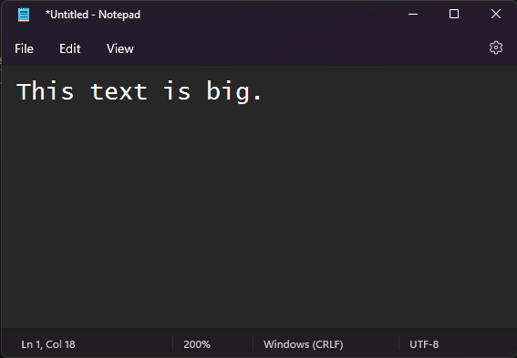

<!--endintro-->

When presenting the screen of your Windows PC to an audience it is important to alter a few things for the best possible experience for the audience. The most import thing is to increase your font to make the content more visible.

Here are some of the applications where it is especially important:

1. Visual Studio
2. Text Editor
3. Command Prompt

### Visual Studio

1. Make your font bigger. This is probably rule number one. There's nothing worse than not being able to see the excellent code you're trying to demo.

   * Increase the font of the Text Editor from 10 to 14 or more.
   * Increate the font of your Environment from 9 to 12 or more.
2. Remove any distracting panes or other windows. These usually just get in the way. If you really need them, make sure they're set to pin mode, so they hide when not in use.
3. Most importantly, you can have all these things done for you at the click of a button by using the [presentation mode extension by Mads](https://devblogs.microsoft.com/visualstudio/use-visual-studio-in-presentation-mode/).

`youtube: https://www.youtube.com/embed/7wMJIYz9lvU`

**Video: Use Presentation Mode in Visual Studio (5 min)** 

::: bad

:::

::: good

:::

### Text Editor

Change font size in your text editor. Zoom in from 100% to 200%.

::: bad

:::

::: good

:::

### Command Prompt

And don't forget to change your command prompt as well. Increase the font size from 12 to 16 or more.

::: bad

:::

::: good

:::

**Tip: You can create a custom profile for Command Prompt in Command Prompt | Settings | Add a new profile.**

