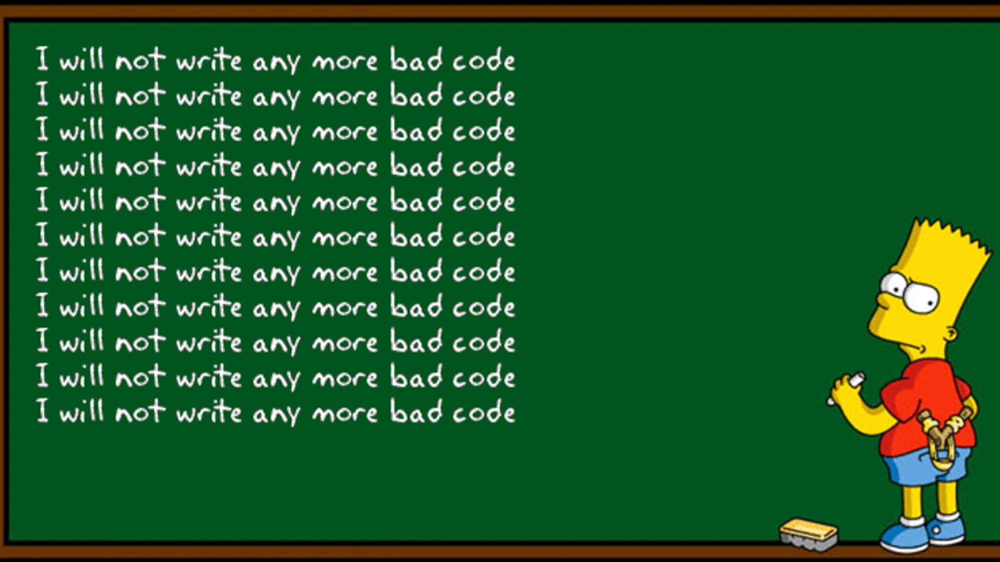
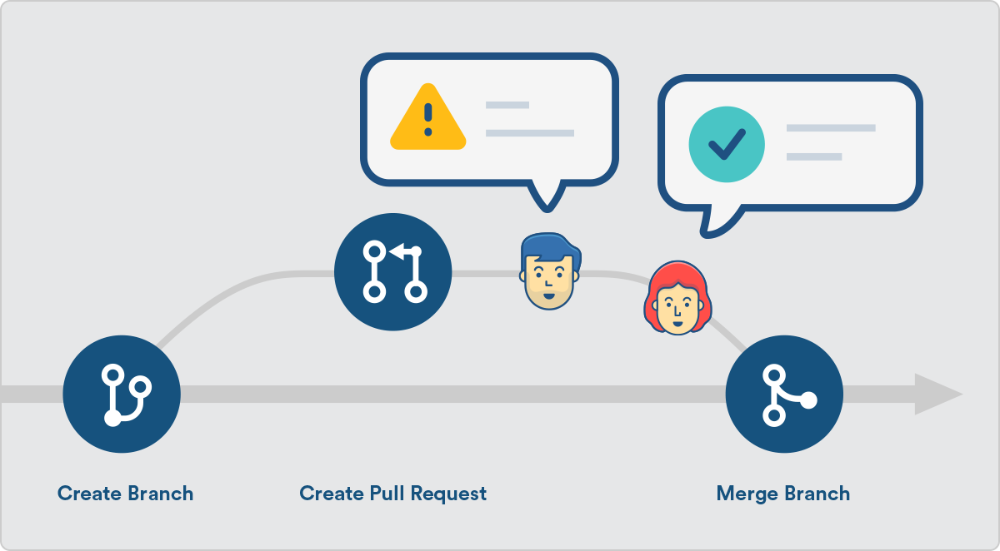
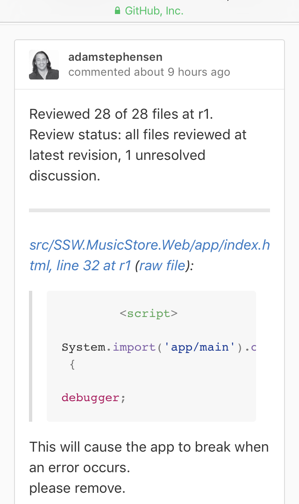

Everybody strives to be perfect, but mistakes are normal, and it is easy for a developer to skim over errors when they've read their own code code hundreds of times!

Pull requests are the best way to ensure that two sets of eyes see every change - so the responsibility is never solely on the person writing the code.

<!--endintro-->

When Pull Requests are enabled, developers must create a branch and make their changes on that branch. Then they submit a Pull Request to merge their changes back into main. Each pull request must be approved by another reviewer.

::: bad  
  
:::

::: good  
  
:::

  

### Useful resources - learn about Pull Requests

* [Pull Requests in GitHub](https://docs.github.com/en/pull-requests/collaborating-with-pull-requests/proposing-changes-to-your-work-with-pull-requests/creating-a-pull-request)
* [Pull Requests in Azure DevOps](https://docs.microsoft.com/en-us/azure/devops/repos/git/pull-requests?view=azure-devops)

`youtube: https://www.youtube.com/watch?v=2VX1ISk9XH8`
**Video: What is a Pull Request? (3 min)**
