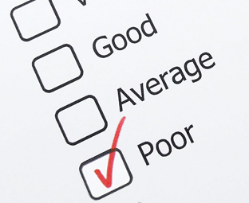
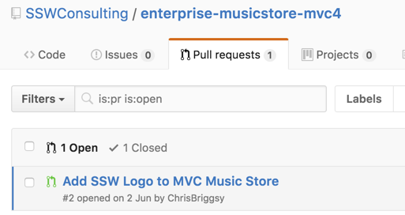

Pull requests make others know about changes you've pushed to a repository. Once a pull request is sent, people can review changes, discuss potential alterations, and even push follow-up commits, if necessary.

::: bad  
  
:::

::: bad  
  
:::

<!--endintro-->

::: good  
  
:::

  

### Useful resources - learn about Pull Requests

- https://docs.microsoft.com/en-us/azure/devops/repos/git/pull-requests?view=azure-devops
- https://yangsu.github.io/pull-request-tutorial/
