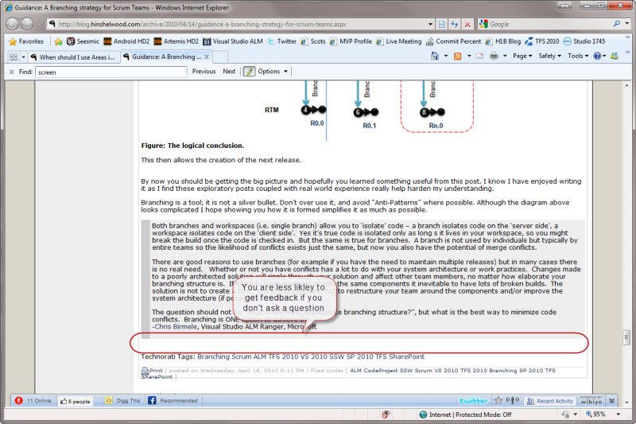
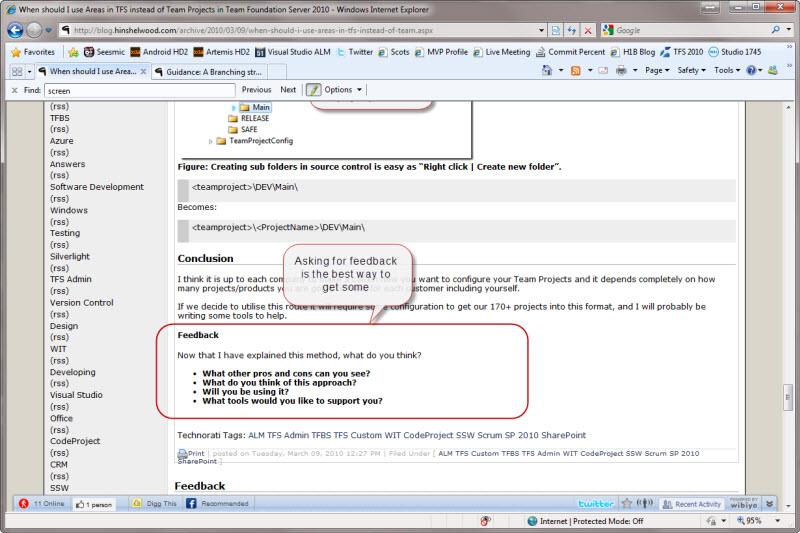

Whether​ you are converting an email to a blog post or writing it from scratch, always invite and instruct discussion. 
 
 <excerpt class='endintro'></excerpt> 
<dl class="badImage"><dt></dt><dd>Figure: Bad example, there are no instructions here</dd></dl><dl class="goodImage"><dt></dt><dd>Figure: Good example – Asking some questions at the end will solicit more feedback</dd></dl> 

Although people may not comply, it helps them adjust from the world of email only.

