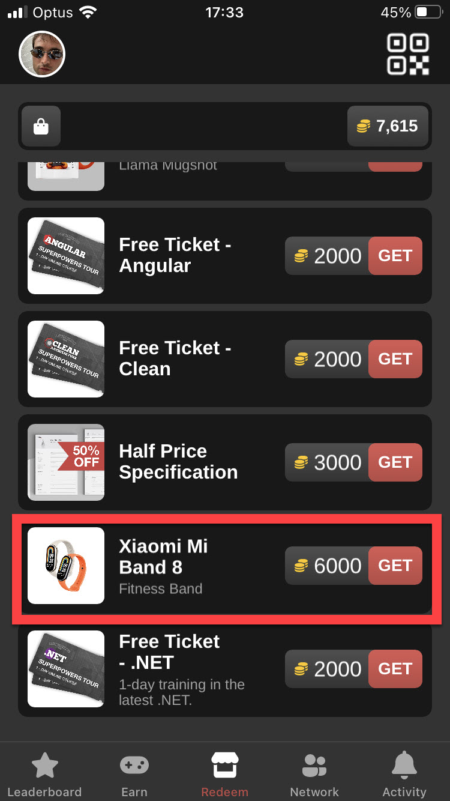

Daily exercise is essential for maintaining peak mental and physical performance. For developers and knowledge workers, staying active helps improve focus, reduce stress, and boost overall productivity. Whether it's a 20-minute walk, a quick gym session, or even stretching between meetings, regular movement keeps your energy levels up and your mind sharp.

Just like writing clean code, **consistency is key** - a little each day makes a big difference over time.

<!--endintro-->

## The problem

Research has increasingly linked sedentary behaviour to negative health outcomes, both physically and cognitively.

[33% of the global population over 15 years old does insufficient physical activity](https://pmc.ncbi.nlm.nih.gov/articles/PMC7700832). Sedentary lifestyles (averaging 7.7 to 8.3 hours daily) lead to metabolic, cardiovascular, and cognitive issues (commonly obesity, diabetes, cancer, and mental health disorders). On top of the physical risks, [sedentary life increases the risk of **subjective cognitive decline**](https://www.tandfonline.com/doi/abs/10.1080/17518420801997007).

> "Sitting is the new smoking"
>
> \- A wise person

## The solution

**Exercise**. You perform better when healthy.

`youtube: https://www.youtube.com/watch?v=wWGulLAa0O0`
**Video: What happens inside your body when you exercise (2 min)**

Since physical fitness is linked to brain health, it should come as no surprise that it's also linked to performance on complex tasks.

Specifically your memory and thinking skills: [Harvard Business Review - How exercise can boost your memory and thinking skills](https://www.health.harvard.edu/mind-and-mood/exercise-can-boost-your-memory-and-thinking-skills).

[It affects mental health too - a study done at the University of South Australia](https://bjsm.bmj.com/content/57/18/1203) found that when battling depression, exercise is 1.5x more effective than counselling or medications.

### Turn fitness into numbers (gamify 🎮)

What's more of an accomplishment - 'I ran for 30 minutes', or 'I did a 5k in 20 minutes'?

For most people, the latter is better because it has a specific definition and a metric to improve.
There are entire apps based on this! (like [Strava](https://www.strava.com))

With an appropriate tool (e.g. fitness band, smartphone, fitness ring) you can get a similar target with steps/day (e.g. 10,000) that you can measure yourself and push against.

:::img-medium

:::

Download the app: [SSW Rewards](https://www.ssw.com.au/products/rewards).

### 🏃‍♂️‍➡️ Make it simple

[A healthy team is more energized, happy, and productive](https://www.cdc.gov/workplace-health-promotion/media/pdfs/2024/06/workplace-physical-activity-break-guide-508.pdf), and a culture to encourage this should come from the top. The simplest plan is a walk, preferably outdoors to soak in some natural sunlight for a [healthy dose of Vitamin D](https://www.betterhealth.vic.gov.au/health/healthyliving/vitamin-d), while being mindful of sun safety practices.

Even though most of us are busy, all it takes is 20 minutes.

For some people, these kinds of planned sessions work well. For others, it works better to have a [small habit that acts as a reminder](/lasting-habits).

### 🧠 Make a system

Studies show that while working, taking 5 minute breaks every 30 mins increases productivity (see [the Pomodoro Technique](/pomodoro)). You could use this break to [stretch or do a couple exercises](https://www.ssw.com.au/rules/stretch-at-work/).

Or, you can tie an action that you already do to a quick exercise. For instance:

| Every time you | Exercise |  Points |
|--------|----------|----------|
| Get tired | Raise the desk to standing level | 100
| Say a swear word 🤬 | 10 push-ups (only do this if you want to stop swearing) | 200 |
| Have a 1-on-1 meeting | Do a walking meeting (only if you don't require a computer) | 500 |
| It's a sunny day today | Walk or ride a bike to work | 500 |

Even small efforts can improve circulation and mental sharpness.

> "As soon as I wake up in the morning, I do a maximum effort set of push-ups until I fail."
>
> \- Seth Daily

::: good
Figure: Good example of a small habit for long-term health
:::
