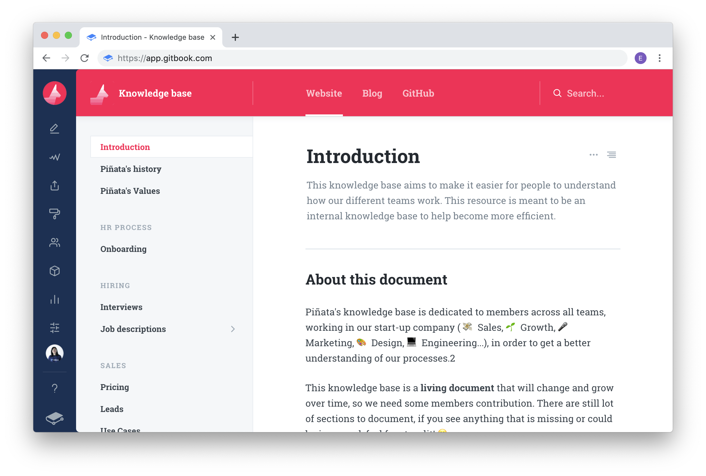

## Developer Documentation

Developer documentation is stored close to the code. Examples are GitHub wiki and Azure DevOps wiki. What about end user documentation?

<!--endintro-->

`youtube: https://www.youtube.com/watch?v=XJtB6fqJk1o`
**Video: GitBook vs. TinaCMS: Best Options for End-User Documentation | Seth Daily (4 min)**

## End-User Documentation

### Option 1: Word document

[word](https://www.microsoft.com/en-au/microsoft-365/word?WT.mc_id=DP-MVP-33518)

✅ **Pros:**

* Content - Easy to edit
* Navigation - Has nice navigation on the left

❌ **Cons:**

* Copying Code - No code elements for technical training
* No Google Analytics  
* Not native to the web  

### Option 2: Plain HTML pages

✅ **Pros:**

* You have complete control over how it looks
* Can add Google Analytics

❌ **Cons:**

* Content - Hard to edit using HTML
* Navigation - Does not have any navigation
* Copying Code - No code elements for technical training
* Lacks basic features, like search

### Option 3: GitBook

[GitBook](https://gitbook.com)

✅ **Pros:**

* Content - It's in Markdown  
* Navigation - Has nice navigation on the left
* Copying Code - If you have code elements for technical training it allows easy copying and pasting
* Simple Branding options
* It's in GitHub - allows people to give suggestions
* Integrated search  
* Integrated with Google Analytics

❌ **Cons:**

* $ 6.70 USD per user per month (expensive)

### Option 4: Nextbook

[Nextbook](https://github.com/amiroff/NextBook)

✅ **Pros:**

* Content - It's in Markdown
* Navigation - Has nice navigation on the left
* Copying Code - If you have code elements for technical training it allows easy copying and pasting
* It's in GitHub - allows people to give suggestions

❌ **Cons:**

* No Integrated search
* No Integration with Google Analytics
* No Branding options
* Solo maintainer
* Clunky menu system

### Option 5: Docusaurus

[docusaurus.io](https://docusaurus.io/)

✅ **Pros:**

* Content - It's in Markdown
* Navigation - Has nice navigation on the left
* Copying Code - If you have code elements for technical training it allows easy copying and pasting
* Branding via CSS
* It's in GitHub - allows people to give suggestions
* Maintained by Meta (Facebook)
* Highly customizable via plugins
* Integrated search (Algolia and more)
* Integration with Google Analytics (plugin)
* Internationalization (i18n) support
* Free

❌ **Cons:**

* Need to self-host

### Option 6: TinaCMS (recommended)

✅ **Pros:**

* Content - Supports Markdown
* Editing - user-friendly WYSIWYG editor
* Copying Code - Supports easy copying and pasting of code elements
* Customization - Freedom to build custom React components
* Seamless with GitHub - Allows for pull requrests and suggestions
* Internationalization (i18n) support
* Pricing - Free for small projects and flexible pricing for larger ones
* Hosting - free to choose - no lock in
* Works with Docusaurus

❌ **Cons:**

Developer investment - You get the best experience by taking the time to develop custom components
