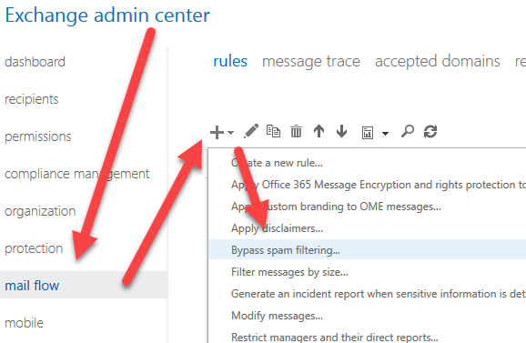
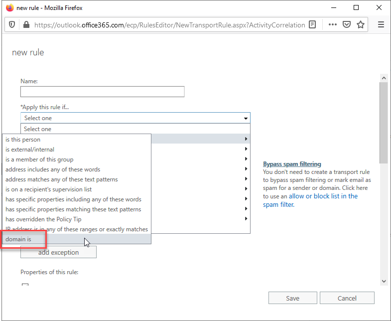

Zendesk is being used everywhere now, and it is good! To ensure you are receiving important internal tickets, you need to whitelist your Zendesk domain in your primary email server. 
 <excerpt class='endintro'></excerpt> 

​If you are using Exchange, you can do this by doing the following: 
<ol><li>Go to your Exchange Admin Center (if Office 365, https://outlook.office365.com/ecp/);</li><li>Mail Flow | + icon | Bypass spam filtering: 
   <dl class="image"><dt></dt><dd>Figure: Bypass spam filtering setting in Exchange</dd></dl></li><li>On the new window that opens, type a good name for the rule | Apply this rule if... | domain is | type your Zendesk domain (in our case, ssw.zendesk.com): 
   <dl class="image"><dt></dt><dd>Figure: Adding domain to bypass list​ </dd></dl></li><li>The rest should already be correctly configured, hit Save</li></ol>Done! You now allow any Zendesk emails through your server correctly. No more missing important tickets!" 

