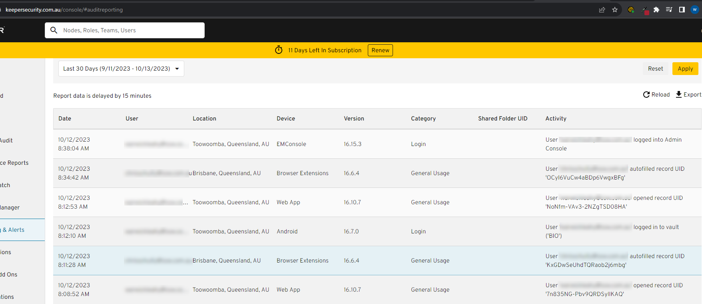
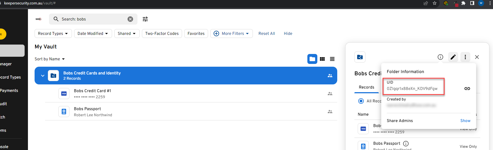
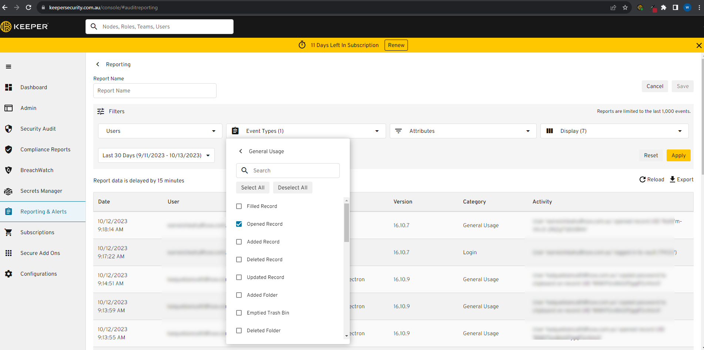
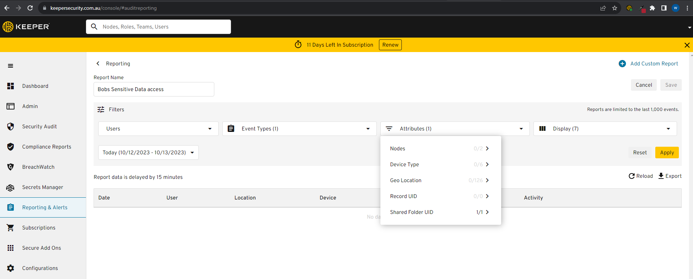
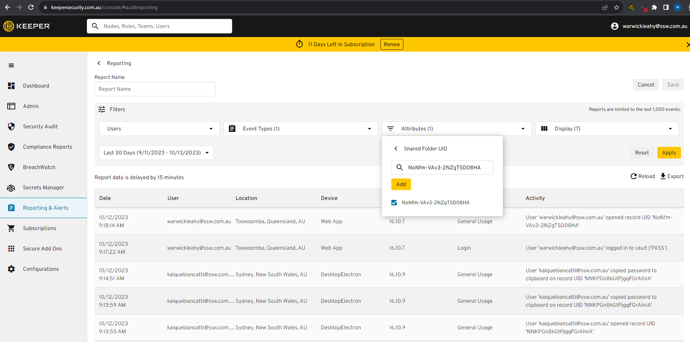

1. Auditing access data is crucial for any enterprise to ensure security and compliance. Having an audit trail provides visibility into who accessed what data, when, and from where. An effective enterprise password manager should be able to offer this feature. 

<!--endintro-->

Keeper is a leading enterprise password manager that offers a comprehensive auditing feature. It provides administrators with detailed logs and reports on user access, ensuring transparency and accountability.

### **Finding Audit Data for a Particular Folder or Record in Keeper**

1. **Get the UID of the folder/item**: First get the UID of the folder or item that you want to audit

   
2. **Login to the Keeper Admin Console**: Now switch to Keeper's admin console and login.
3. **Navigate to the 'Reporting & Alerts' Section**: This allows an admin to create a custom report.  Then add a new report.

::: greybox 
   **Tip - you can then create an alert from that report if required**
:::

   
5. **Apply Filters**: You can filter the audit logs by various criteria, including user, date range, or specific activities. To find audit data for a particular folder or record, input its name or related keyword in the search or filter option.

   

   

   
6. **Filter Time/User**: Choose any other filters such as Time Period or User and click apply
7. **Review the Logs**: Once filtered, you'll see a list of actions related to the chosen folder or record. This will include details like who accessed it, when, and from which device or location.

   
8. **Export or Save**: If you wish to keep a record of the audit data outside of Keeper, you often have the option to export the data to various formats or save it for later review.

### **Why is Auditing Access Data Important?**

* **Security Oversight**: Monitoring who accesses data and when can identify potential security breaches or unauthorized access attempts.
   
* **Compliance**: Many industry regulations mandate businesses to maintain a detailed audit trail of data access, especially for sensitive or personal data.
   
* **Accountability**: An audit trail holds users accountable for their actions, discouraging misuse or unauthorized changes.

When selecting an enterprise password manager, auditing capabilities should be a priority. Keeper serves as a strong example of how detailed and user-friendly audit features can enhance security and transparency in data management.
