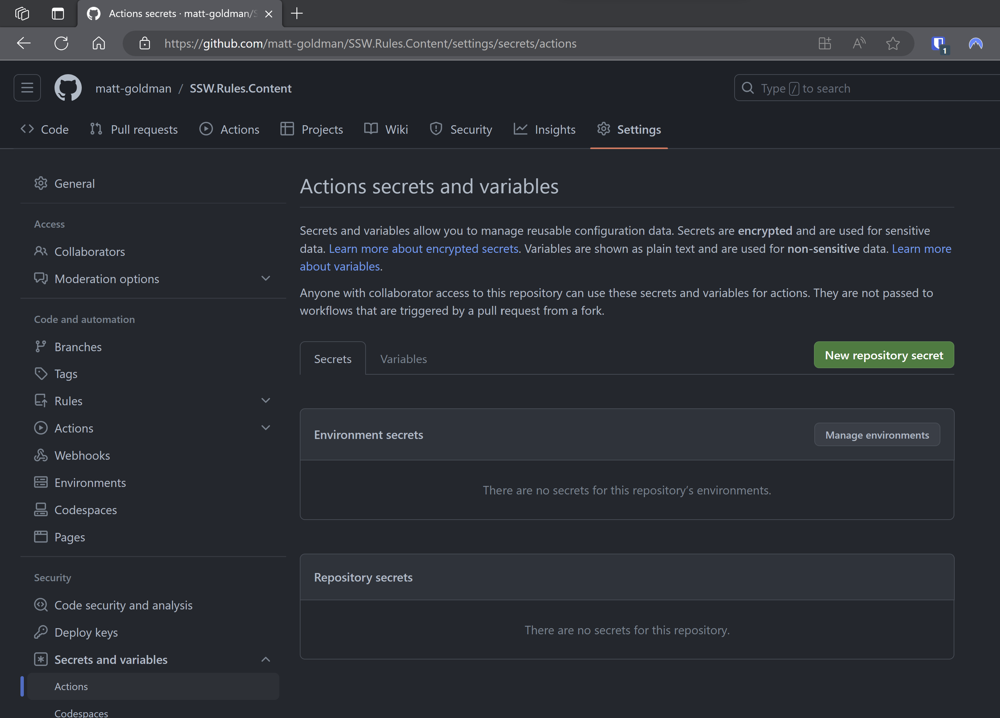
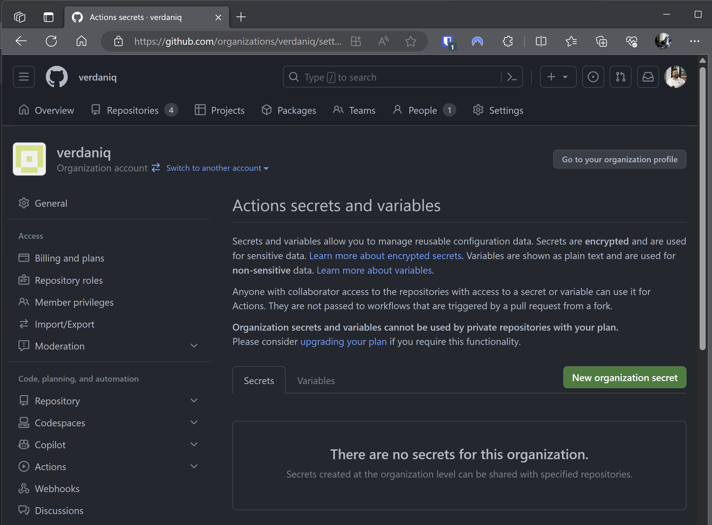
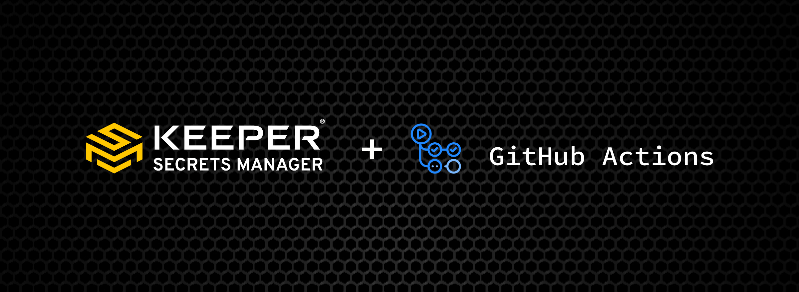

Managing secrets is hard. It's not just about storing them securely, but also ensuring that the right people and systems have access to them in a controlled manner, with an auditable trail, while minimizing friction for the processes that legitimately need them, like DevOps pipelines. You wouldn't leave your front door key under the mat, but at the same time you don't want it to take 7 minutes and approval from 4 people to unlock your front door.

<!--endintro-->

In a development ecosystem, secrets are the lifeblood that makes many processes tick smoothly – but they're also a potential point of vulnerability. When multiple repositories and workflows require access to shared secrets, like an Azure Service Principal or credentials for a service account, the management overhead increases. Imagine the pain of secrets expiring or changing: the need to update each and every repository that uses them emerges. Beyond the inconvenience, doing this manually for each repository is not only tedious but fraught with risks. An erroneous secret entry might break a CI/CD pipeline or, even worse, pose a security risk. Let's explore ways to handle secrets more efficiently and securely.

## Scenario: Every time a new repository is set up, developers manually add secrets to it.


:::bad

:::

### Problems:

❌ High maintenance if secrets need to be changed or rotated.\
❌ Greater risk of inconsistencies between repos.\
❌ Increased vulnerability surface area – each repo is a potential leak point.


## Scenario: Instead of per repo, secrets are added at the GitHub organization level.

:::ok

:::

### Advantages:

✅ Easier management as secrets are centralized.\
✅ Reduced chances of inconsistencies.\
✅ Less manual work for individual repos.

❌ Still a concern - While more efficient, secrets still reside within the CI/CD tool and can be exposed if the platform is compromised.


## Scenario: Secrets are stored in Azure Key Vault and accessed by various workflows as needed.

```yaml
name: Deploy API

on:
  push:
    branches:
      - main

jobs:
  deploy:
    runs-on: ubuntu-latest

    steps:
    # Check out your code
    - name: Checkout code
      uses: actions/checkout@v2

    # Login to Azure
    - name: Login to Azure
      uses: azure/login@v1
      with:
        creds: ${{ secrets.AZURE_CREDENTIALS }} # Note you need this credential in GitHub

    # Fetch the API key from Azure Key Vault
    - name: Get API key from Azure Key Vault
      run: |
        az keyvault secret show --name SSW_REWARDS_API_KEY --vault-name kv-rewards --query value -o tsv > api_key.txt
      id: fetch-key

    # Use the API key in a subsequent step
    - name: Deploy with API Key
      run: |
        API_KEY=$(cat api_key.txt)
        # Your deployment commands using the API_KEY

    # (Optional) Logout from Azure
    - name: Logout from Azure
      run: az logout
```
:::ok
Listing: Secrets stored in a dedicated Key Vault in Azure and used by workflows across the organization
:::

### Advantages:

✅ Stronger security - Azure Key Vault provides enhanced encryption and access control.\
✅ Centralized management - Rotate, update, or revoke secrets without touching individual repos or workflows.\
✅ Auditing - Track who accesses what and when.

❌ Still a concern - Dependencies on external systems can introduce complexities and may require specific expertise to manage.


## Scenario: Secrets are stored in an enterprise-grade secrets manager, which integrates directly with CI/CD platforms.


:::good

:::

<a href="https://vimeo.com/672797748">Watch the video</a>

### Advantages:

✅ **Top-tier Security** - Dedicated systems like Keeper are designed with advanced security features.\
✅ **Streamlined Management** - Centralize not just CI/CD secrets, but potentially all organizational secrets.\
✅ **Granular Control** - Control who can access what, with full audit trails.\
✅ **Integrations** - Seamless integration with CI/CD platforms reduces friction and the potential for errors.

## Conclusion:

Leveraging specialized tools reduces manual overhead, boosts security, and ensures a smooth CI/CD process.

Note that in all of these cases, you still need at least one secret stored with your pipeline, whether that's a service principal to log in to Azure to retrieve secrets from Key Vault, or Keeper Secrets Configuration (or equivalent) to access your enterprise secrets manager. Note that if you require different permissions for different workflows or repositories, you may end up with as many secrets in your pipeline tool as if you had the target secrets themselves there.

This may seem counter-productive, but in most cases this is still a better way to manage your secrets, as you still have enterprise controlled access and governance, and a single source of truth.

Remember, the ideal approach may vary based on the size of the organization, the nature of the projects, and specific security requirements. But centralizing and bolstering security around secrets is always a prudent approach.