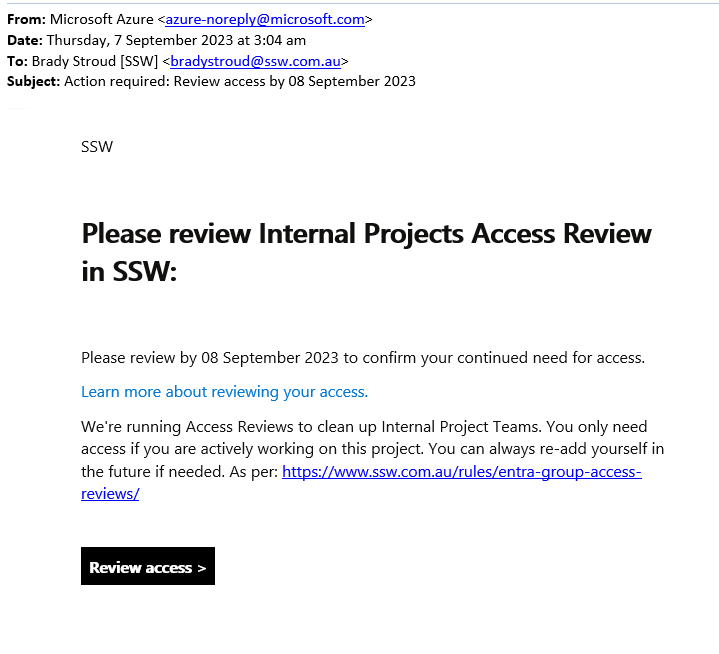
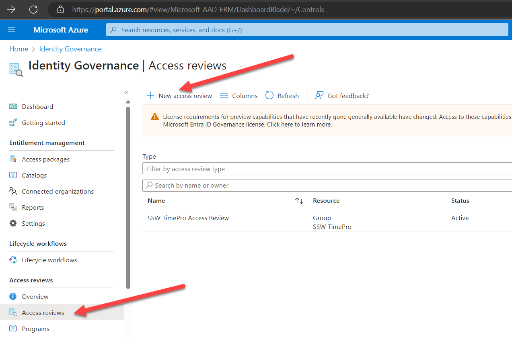
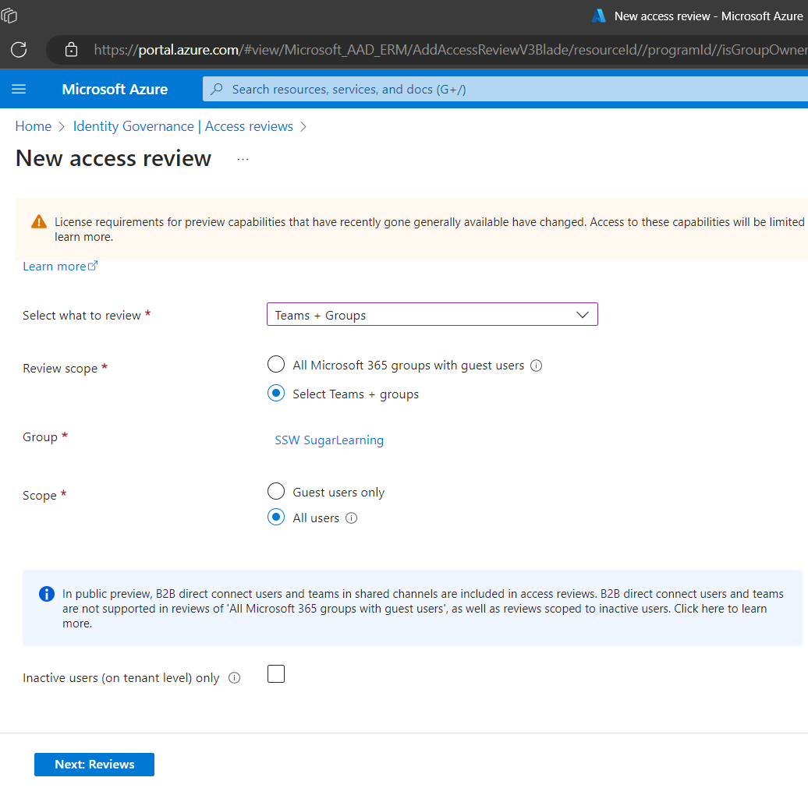
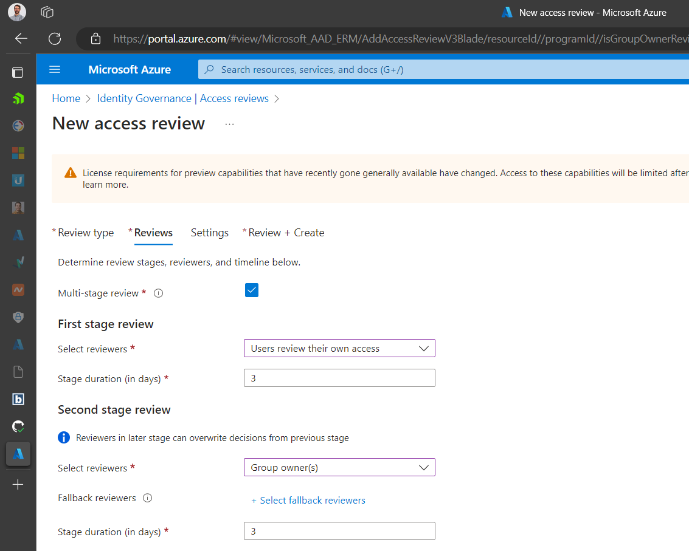
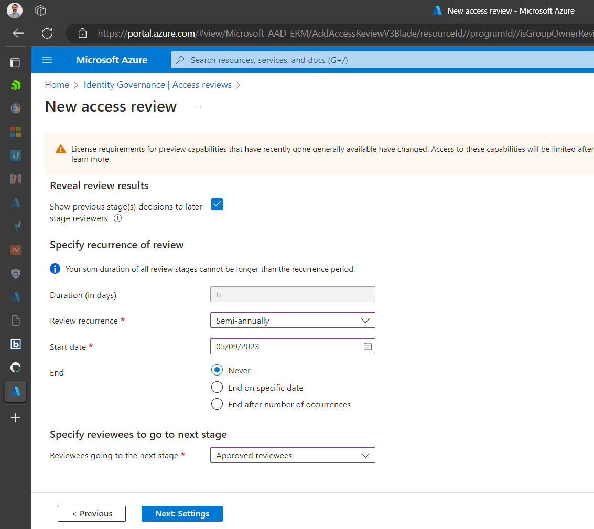
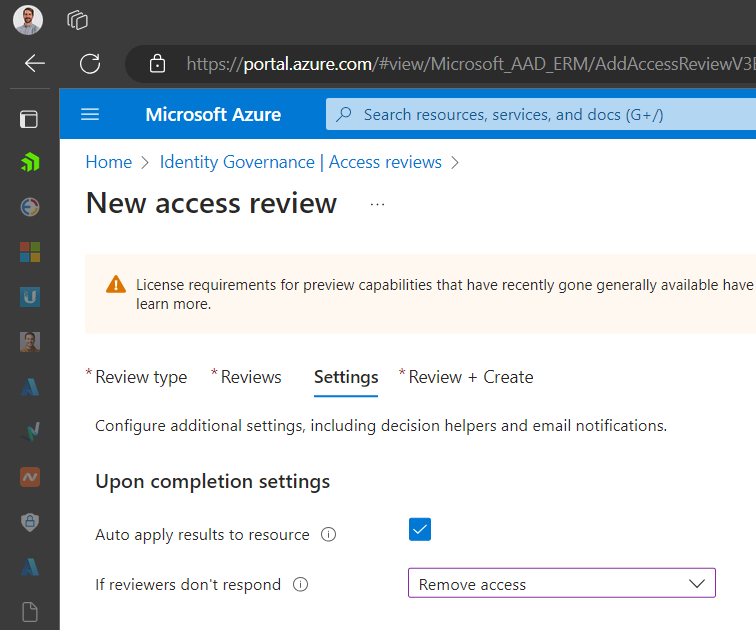
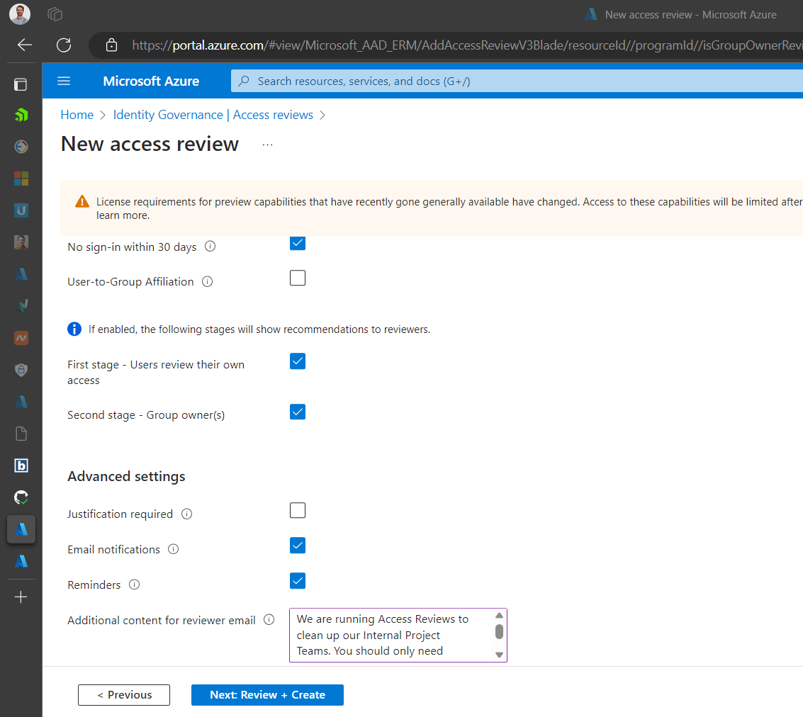
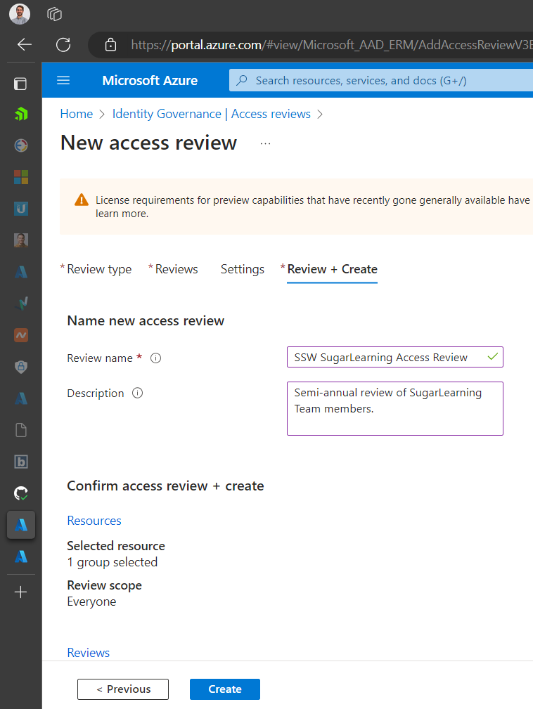
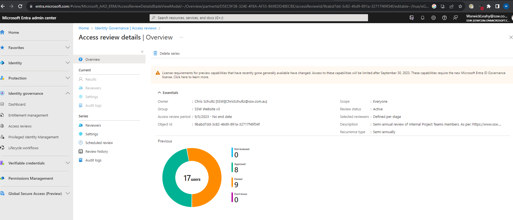

When you have multiple ongoing projects with people moving in and out of project teams, you can end up with too many people in the related groups - especially if you are using public Microsoft 365 groups that anyone in the organization can join. 

With [Access Reviews](https://learn.microsoft.com/en-us/azure/active-directory/governance/access-reviews-overview), you can automate cleaning up these groups and make sure only the right people have ongoing access.

<!--endintro-->

### Why use Access Reviews?

In today's digital landscape, ensuring the right people have the right access to resources is paramount. Over time, as employees change roles, projects evolve, or external collaborators come and go, permissions can become outdated. This can lead to excessive access rights or, conversely, insufficient access, both of which pose risks. Excessive access can open doors to potential security breaches, while insufficient access can hinder productivity.

"Entra Access Reviews" provides a systematic way to review and validate user access rights regularly. By conducting periodic access reviews, organizations can identify and rectify any inappropriate permissions, reducing the risk of unauthorized access or data breaches. Moreover, it ensures that users have the necessary access to perform their roles efficiently. Access reviews also support compliance efforts, as many regulatory frameworks require periodic reviews of access rights. With "Entra Access Reviews", organizations can automate this process, ensuring a consistent, auditable, and efficient approach to maintaining secure and compliant access controls.

### User Experience During an Access Review

When it's time for an access review, users receive a notification prompting them to validate their access rights. This user-friendly process is designed to be intuitive, guiding users step-by-step through the review of their permissions. They'll see a clear list of the resources they currently have access to and will be asked to confirm if they still require that access. This self-review empowers users to be part of the security and compliance process, ensuring they only have access to what they genuinely need. The interface is clean and straightforward, minimizing any potential confusion. Below is a screenshot that provides a glimpse into what users see during this process:

### Creating an Access Review

1. Go to the **Azure Portal | Identity Governance | [Access Reviews](https://portal.azure.com/#view/Microsoft_AAD_ERM/DashboardBlade/~/Controls)**
2. Click **+ New Access Review**

3. Under **Select what to review**, choose **Teams + Groups**
4. Under Review scope, choose **Select Teams + Groups**
5. Click on **+ Select groups** and choose the group you want to review
6. Under **Scope** select **All users**
7. Click **Next: Reviews**

8. Check the **Multi-stage review** box
9. Under **First stage review | Select reviewers**, choose **Users review their own access**
10. Select a stage duration (default is **3 days)**
11. Under **Second stage review | Select reviewers**, choose **Group owner(s)**
12. Select a stage duration again (default is **3 days)**

13. Under **Specify recurrence of review**, select a **Review recurrence** and **Start date**
14. Under **Specify reviewees to go to next stage**, choose **Approved reviewees**
15. Click **Next: Settings**

16. Under **Upon completion settings**, tick **Auto apply results to resource**
17. Under **If reviewers don't respond**, choose **Remove access**

Under **Advanced Settings**

18. Turn off **Justification required**
19. Under **Additional content for reviewer email**, add an explanation so there's no confusion over what this email is.
20. Click **Next: Review + Create**

21. Under **Name new access review**, add a name and description
22. Review the details and click **Create**

## The Results

At the end of the review we get to see the results

