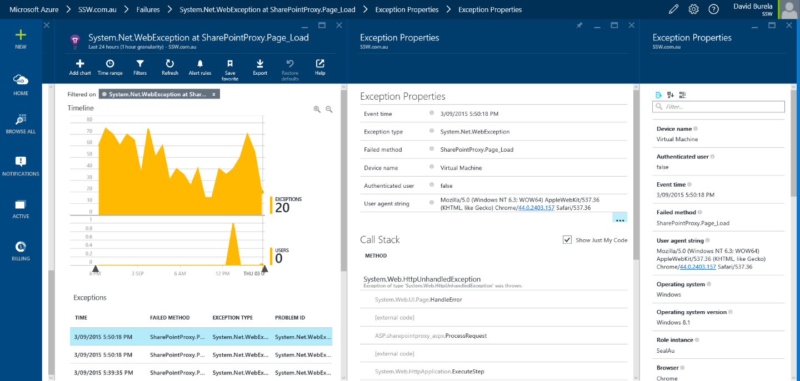

Application Insights can provide an overwhelming amount of errors in your web application, so use just-in-time bug processing to handle them.

<!--endintro-->

The goal is to each morning check your web application's dashboard and find zero errors. However, what happens if there are multiple errors? Don't panic, follow this process to improve your application's health.
<dl class="image">&lt;dt&gt;
       
   &lt;/dt&gt;<dd>Figure: Every morning developers check Application Insights for errors </dd></dl>
Once you have found an exception you can drill down into it to discover more context around what was happening. You can find out the user's browser details, what page they tried to access, as well as the stack trace (Tip: make sure you follow the rule on [How to set up Application Insights](/_layouts/15/FIXUPREDIRECT.ASPX?WebId=3dfc0e07-e23a-4cbb-aac2-e778b71166a2&TermSetId=07da3ddf-0924-4cd2-a6d4-a4809ae20160&TermId=68f64a3a-78ec-49f6-87ed-7ee92af1c809) to enhance the stack trace).
<dl class="image">&lt;dt&gt; 
       
   &lt;/dt&gt;<dd>Figure: Drilling down into an exception to discover more.</dd></dl>
It's easy to be overwhelmed by all these issues, so don't create a bug for each issue or even the top 5 issues. Simply create one bug for the most critical issue. Reproduce, fix and close the bug then you can move onto the next one and repeat. This is just-in-time bug processing and will move your application towards better health one step at a time.
<dl class="badImage">&lt;dt&gt; 
       
   &lt;/dt&gt;<dd>Figure: Bad example - creating all the bugs</dd></dl><dl class="goodImage">&lt;dt&gt;
       &lt;/dt&gt;<dd>Figure: Good example - create the first bug (unfortunately bug has to be created manually) </dd></dl>
