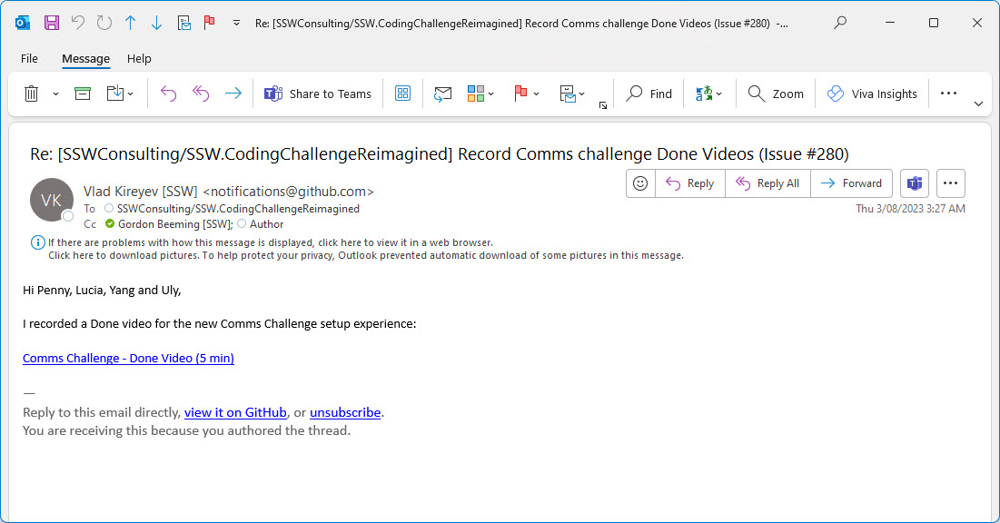
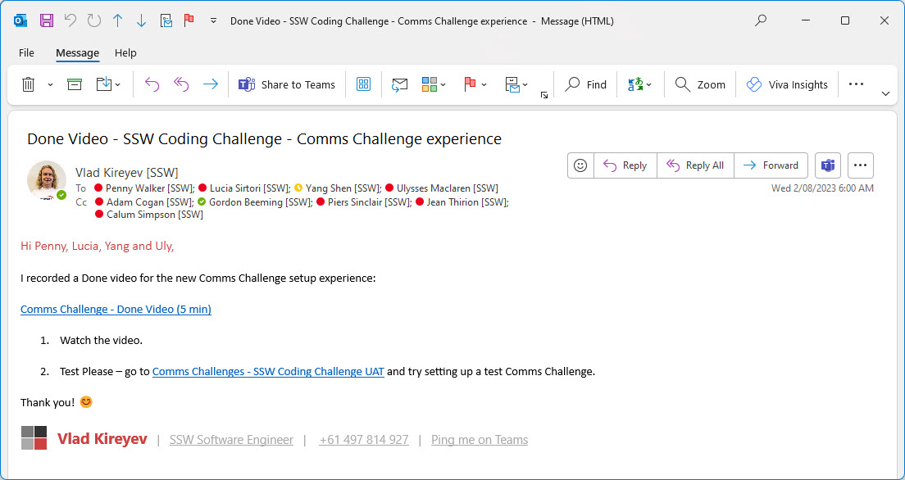

Key updates on projects may include Done Videos, critical text additions, or specification documents. Typically, links to these deliverables would be added to the PBI that they relate to and the relevant people would be mentioned. 

::: bad  

:::

::: good  
  
:::

Not every PBI will require an email, but if it is a key update or deliverable, it should be escalated.

<!--endintro-->

For example, you can send an email similar to this to share a new Done Video to the relevant stakeholders. If you working on a big system or internal projects, include the feature area or project name in the subject for additional context.

::: email-template  
| | |
| -------- | --- |
| To: | {{ PRODUCT OWNER }}; {{ OTHER STAKEHOLDERS }} |
| Subject: | 🎥 {{ PROJECT NAME }} - Done Video for {{ PBI TITLE }} |  
::: email-content

### Hi Team,

I just made a Done Video for this PBI {{ LINK TO PBI }}.

{{ LINK TO VIDEO }}

If you have any feedback, please post it on the PBI.

&lt;This email was sent as per https://www.ssw.com.au/rules/escalate-key-updates/ &gt;

:::  
:::

This email is especially important for stakeholders that don't use, want to use, or have access to the project management tools. If they do have access, remember to also @mention them in the PBI update as per [Do you know when you use @ mentions in a PBI?
](https://www.ssw.com.au/rules/when-you-use-mentions-in-a-pbi/)
