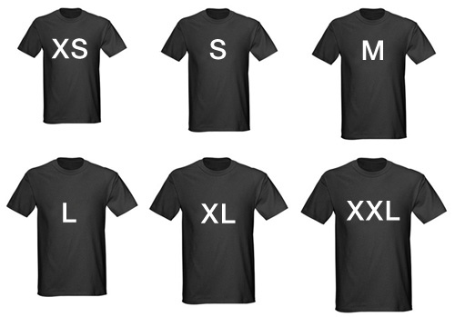
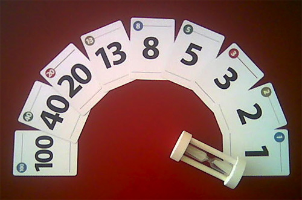
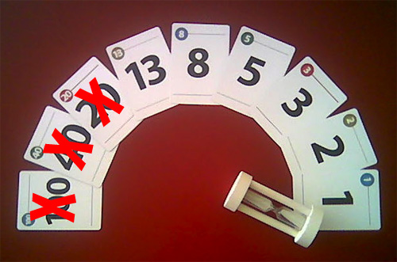
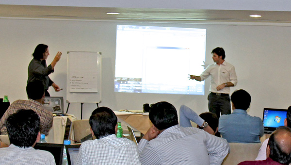

A team knows how many PBIs they can commit to by measuring their velocity. The Team estimates the highest priority PBIs in the Product Backlog in Story Points. It is very important for teams to estimate tasks effectively. There are several methods for estimating:

* Shirt Sizes
* Fibonacci Extended (1-100)
* Fibonacci Original (1-21)
* Doubling
* Thrown

<!--endintro-->

Let's go through them:

### Shirt Sizes

This method is popular with Microsoft teams, but it has the problem of not easily mapping to the common 7 numbers when you enter it into a Task tracking Bug database. e.g.

> ::: greybox
> 1 = XS
> 2 = S
> 4 = M
> 8 = L
> 16 = XL
> 32 = XXL
> 64 = XXXL
> 
> :::
> 
> **Please note:** In some teams which only use Small, Medium and Large the following numbering is applyed respectively 2, 4 and 8.

::: bad  
  
:::

### Fibonacci Extended (1-100)

Planning Poker is a very effective Product Backlog estimation technique and the most common method is using Fibonacci numbers (1,2,3,5,8,13, etc.). This was made popular by Mike Cohn.

::: good  
  
:::

### Fibonacci (1-21)

Mike Cohn introduced changes to the original 7 cards, by changing the 21 to 20 and adding 40 and 100 to indicate very large user stories called Epics.

Ken Schwaber (the father of Scrum) says in his Scrum Certification course, that he is not a fan of the extra cards and says he prefers teams keep to the original 7 cards.

::: good  
  
:::

### Doubling (recommended)

Estimating using doubling numbers makes relative sizing simple. An 8 point PBI should be about twice the size as a 4-point PBI. This method also simplifies PBI swapping where a PBI is replaced with PBIs totaling the same number of points.

It has one other advantage over the Fibonacci sequence, it is easier for non-techies because the numbers aren't whacky and the name isn't bizarre.

::: greybox
 **Estimate** 
1
2
4
8
16
32
64

:::

::: good
Figure: Good example -Doubling simplifies relative sizing  
:::

### Thrown

Another method of estimating is the "Thrown method" as described Martin Fowler. http://martinfowler.com/bliki/ThrownEstimate.html

This is particularly useful if you don't have Planning Poker cards.  Instead of Fibonacci numbers, estimates are from 1 to 5.  It's nice and simple, and you only need the fingers on your hand.

The action is done in the same method as the game 'Rock, Paper, Scissors'. The options the developer can estimate is 1,2,3,4,5

  

### Other Tips

**#1 Don't Shout Out** 
It will just influence other people's votes.

**#2 Guidelines for Estimating PBIs (aka Anchoring)** 
Every team is different, but you can use the following guidelines for sizing PBIs.

| **Estimate Value**  | **Example PBI**  |
| ------------------- | ---------------- |
| 1 | A change to a message box |
| 2 | - |
| 4 | A timeboxed task for 1 day x 1 guy |
| 8 | A timeboxed task of 1 day x 2 guys |
| 16 | - |
| 32 | - |
| 64 | More than a month with a couple of guys. **Tip:** Don't include these in a sprint because they are too risky - ask for them to be broken down. |
 
::: good
Figure: Good example - Example PBI estimates  
:::

**#3 Using a Chat Program** 
If you are working on a project with a remote team, use Microsoft Teams chat to size PBIs using Planning Poker.  Everyone should give their points for PBIs at the same time to avoid influencing each other.

**#4 Big PBIs Smell** 
PBIs of greater than 2 days are a smell and PBIs greater than 4 days are a stench. If PBIs are estimated at more than 4 days of work, consider splitting them into smaller pieces to keep them under 2-4 days.  See Do You Break Large Tasks into Smaller Tasks?

**#5 Use Spikes** 
If you do find a very large PBI, consider using a Spike (aka. an investigation task) to help work out how much work will be involved.

### Related rule

* [Do you estimate “Business Value”?](/do-you-estimate-business-value)
