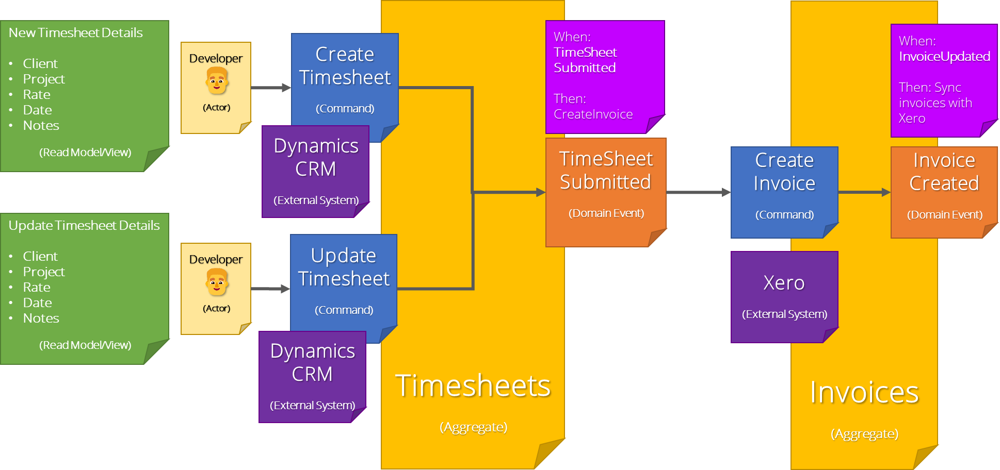

Often when building systems it isn't super clear what all the nuts and bolts should be. There might be several major stakeholders or domain experts each with slightly different ideas understanding that causes contention in how the system functions. 

[Event Storming](https://www.eventstorming.com/) is a fun collaborative modeling technique invented by [Alberto Brandolini](https://twitter.com/ziobrando) that enables members from different teams and disciplines to participate in workshops to learn how to break down complex business domains and processes. 

<!--endintro-->

`youtube: https://youtu.be/Y7NzXl-ahtU`

### Event Storming can be done at different levels

There are multiple levels that Event Storming workshops can be run at. Each level continues to refine and enrich the domains with new concepts until a full end-to-end flow of the system is visualized. This end-to-end flow is valuable to the business itself but also helps accelerate software design and development.

#### Big Picture (aka 30,000 foot view)

* Explore the whole business across multiple boundaries by gathering people who each own/understands one part of the truth
* All Domain events are described in past tense (past tense because it's an event that happened, its a fact that cannot be changed)
* Capture hotspots or points of contention in a domain (this is usually when the experts don't all agree on a concept)
* Map the relationships between the domain and external dependencies

##### Example events

```
🟧 InvoiceCreated

🟧 InvoiceReceived

🟧 EmailSent

🟧 ReportUpdated
```

#### Process Modeling (aka 10,000 foot view)

* Model a single business process from beginning to end and ensure no ambiguity or contention exists by clarifying all the business rules
* Enforce a timeline so that you can move events into the right order, and eventually see a process or flow emerging.
* Attach the actors, their motivations, and any dependencies required for executing actions (aka Commands)
* Enable stakeholders, domain experts and developers to communicate via **ubiquitous language** (all participants are able to communicate using the same terminology)

#### Software Design

* Now we have an end-to-end model of the system
* All relevant concepts are captured and documented
* The software design phase can proceed using methods from Domain-Driven Design (DDD), [Clean Architecture](https://www.ssw.com.au/rules/rules-to-better-clean-architecture) and [CQRS](https://www.ssw.com.au/rules/use-the-mediator-pattern-with-cqrs). Each sticky note can potentially turn into a Product Backlog Item during the software development phase.


Notice as you traverse the levels from top to bottom that new concepts are introduced that help describe the domain or process which gets us closer to being able to build a concrete software solution.  

### How to start an Event Storming workshop

To start an Event Storming workshop, get all the stakeholders, domain experts and developers into a room and hand out sticky notes and pens. 

From here everyone starts to write out all the events they think are necessary on the sticky notes and put the sticky notes on the wall. 

Alternatively, an online platform like [Miro](https://miro.com/) could be used to do it virtually.

Different colored sticky notes should be used to denote different concepts:

```
🟧 Domain Events - Orange

🟨 Actors (aka Personas) - Yellow

⬜ Business Process (aka Policies) - White

🟦 Commands - Blue

🟨 Aggregate - Light Yellow

🟪 External System - Pink/Purple

🟩 Read Model - Green
```

You can use whatever colors you can find, as long as a legend is always visible to the team.



