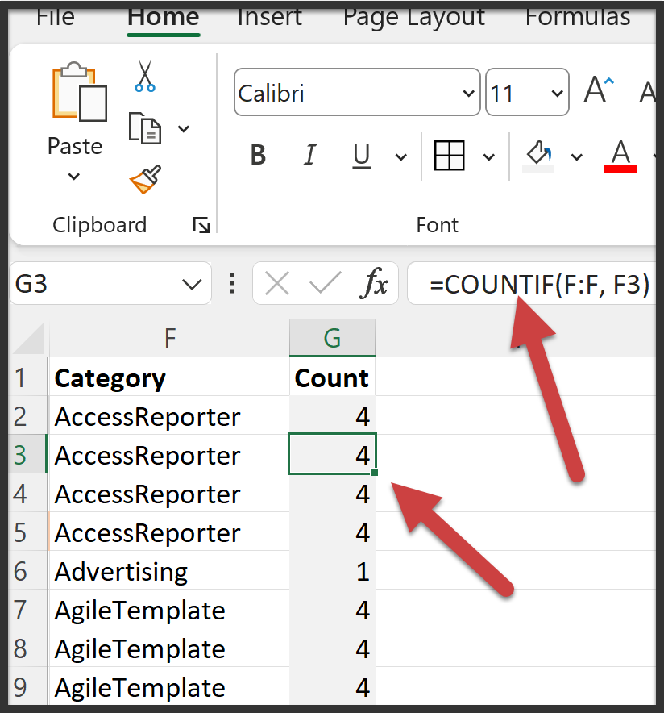

Applying a grey background to formula cells makes it easy to spot them at a glance, reducing the risk of errors and improving the overall organization of your spreadsheet. It helps you quickly distinguish between data and formulas, saving time and making your work more efficient.

<!--endintro-->

## Use visual cues to separate formulas from inputs

To make Excel spreadsheets clearer and more robust, it's best practice to apply a **light grey background** to all formula cells. This helps:

* Prevent accidental overwriting of formulas
* Make the structure of the spreadsheet easier to understand
* Save time for others (and your future self) when maintaining the file

## How to apply the formatting

1. **Identify formula cells** – Use `Go To Special` (Ctrl + G → Special → Formulas).
2. **Apply a light grey fill** – Use a consistent and subtle fill color like `RGB(217, 217, 217)` or use the built-in *20% - Accent1* gray theme in the fill color palette.
3. **Lock the formula cells** and protect the worksheet if you want to enforce this at a technical level (optional but recommended).

::: good

:::

## Bonus tip

Also consider using **cell styles** to standardize this across your organization. Create a custom style for "Formula Cell" with the grey fill.

This visual convention goes a long way in creating clean, maintainable, and user-friendly Excel sheets.
