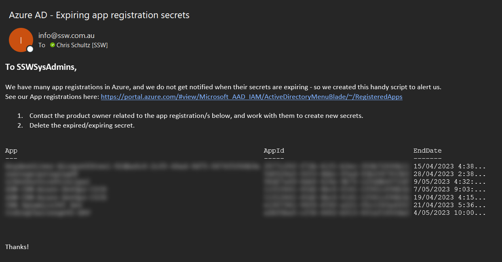

In Entra ID (formerly Azure AD), App Registrations are used to establish a trust relationship between your app and the Microsoft identity platform. This allows you to give your app access to various resources, such as Graph API.

App Registrations use secrets or certificates for authentication. It is important to keep track of the expiry date of these authentication methods, so you can update them before things break.

<!--endintro-->

### Use a PowerShell script to check expiry dates

An easy way to do this is to run a PowerShell script that checks the expiry date of all app registration secrets or certificates. This requires the Microsoft Graph PowerShell module, as the older AzureAD module is deprecated. The key cmdlets used are:

Get-MgApplication
Get-MgApplicationPassword
Get-MgApplicationKeyCredential
Here’s an updated script using the Microsoft Graph module:

```
# Install Microsoft Graph module (if not installed)
if (-not (Get-Module -ListAvailable -Name Microsoft.Graph)) {
    Install-Module Microsoft.Graph -Scope CurrentUser -Force
}

# Connect to Microsoft Graph with appropriate permissions
Connect-MgGraph -Scopes "Application.Read.All"

# Get all applications
$apps = Get-MgApplication -All

# Check expiry dates of secrets and certificates
foreach ($app in $apps) {
    $secrets = Get-MgApplicationPassword -ApplicationId $app.Id
    $certs = Get-MgApplicationKeyCredential -ApplicationId $app.Id

    foreach ($secret in $secrets) {
        if ($secret.EndDateTime -lt (Get-Date).AddDays(30)) {
            Write-Host "Secret for App '$($app.DisplayName)' expires on $($secret.EndDateTime)"
        }
    }

    foreach ($cert in $certs) {
        if ($cert.EndDateTime -lt (Get-Date).AddDays(30)) {
            Write-Host "Certificate for App '$($app.DisplayName)' expires on $($cert.EndDateTime)"
        }
    }
}

```

Automate Expiry Notifications

To receive alerts, you can modify the script to send email notifications using Microsoft Graph API (Send-MgUserMail) instead of Send-MailMessage (which is deprecated). For example:

```
$body = @{
    Message = @{
        Subject = "Expiring App Secrets"
        Body = @{
            ContentType = "Text"
            Content = "The following app secrets are expiring soon..."
        }
        ToRecipients = @(@{ EmailAddress = @{ Address = "admin@example.com" } })
    }
}

Send-MgUserMail -UserId "admin@example.com" -Message $body
```

:::greybox

Note: To run this on a schedule, you should create an app registration to authenticate the script. The app registration will at least need **Application.Read.All** rights to be able to run this.

:::

### Use a Logic App to check expiry dates

If you prefer working with Logic Apps, there's an example of how it can be done here: https://www.inthecloud247.com/get-notified-on-expiring-azure-app-registration-client-secrets/

You will also need an App Registration to authenticate your Logic App. Notifications can then be sent to email or a Teams channel.


