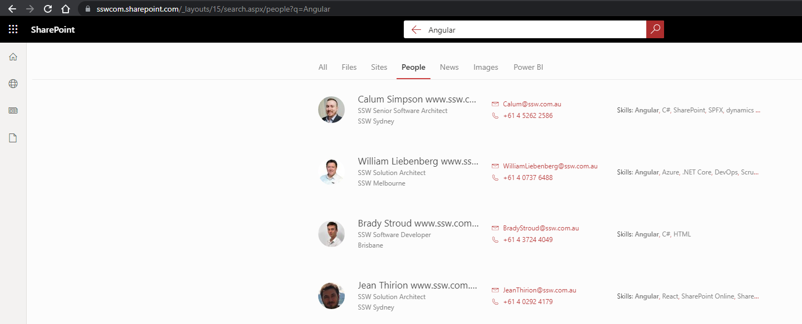
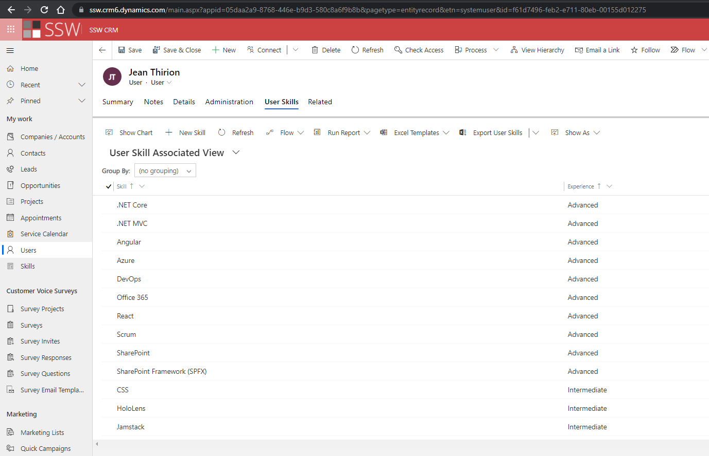
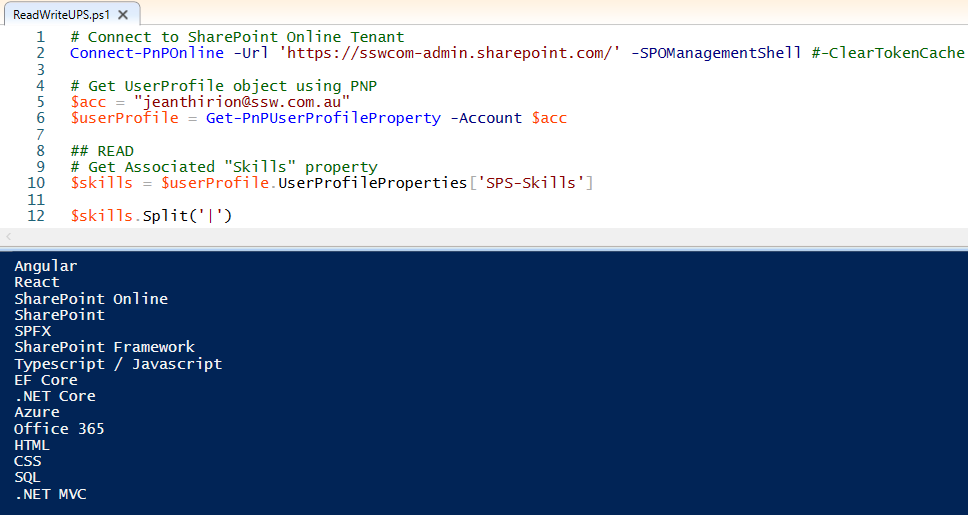
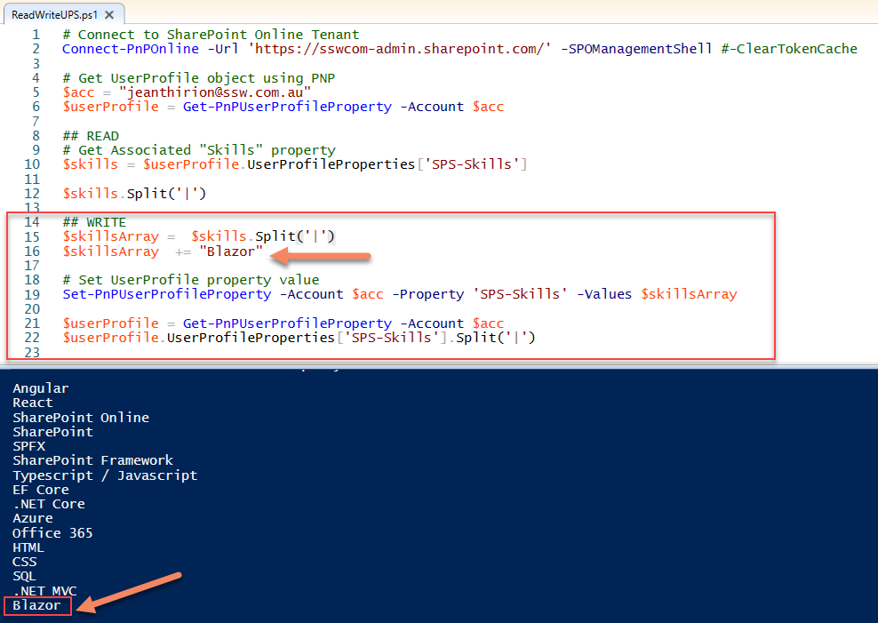
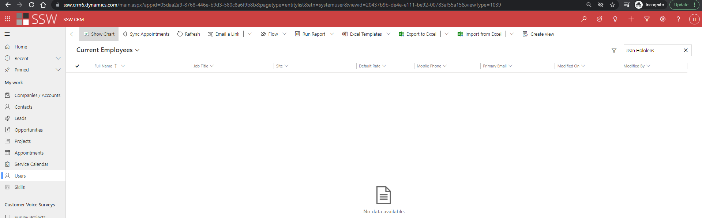

AD has all your users e.g. Bob, Mary, Jane...

SharePoint also has all your users, plus you can extend this information using the UserProfile Service – https://docs.microsoft.com/en-us/sharepoint/manage-user-profiles

The beauty of this is that if everyone has updated their skills, it is wonderfully searchable.

<!--endintro-->

 

SharePoint has an Admin UI to manage User Profiles

 

[Delve](https://aus.delve.office.com) is a cool product with a nice UI that is essentially a portal onto the User Profiles.

 

Where it all falls down...

What if your people’s skills are stored in another system such as Dynamics 365 CRM or Salesforce ?

 

You can use Powershell and SharePoint PNP libraries to read and write from and to the UserProfile service:

 

 

#### Suggestion to Microsoft:

**#1 Data Sync** – this should be a simple SharePoint connector so this piece of powershell glue is not required 👌
e.g. CRM user skills to User Profile properties

**#2 SharePoint Search** – if not using a connector, we should be able to easily index and search through Dynamics 365 CRM data
This is essentially just calling a different API

**#3 SharePoint Search UX** – if you don’t want either of those options (i.e. you users’ skills are stored somewhere else), we should be able to change the search results UI
e.g. “Search for people here: https://ssw.com.au/people”

**#4 Dynamics Search** – there should be a global user search that goes across all entities in Dynamics 365 CRM

 

