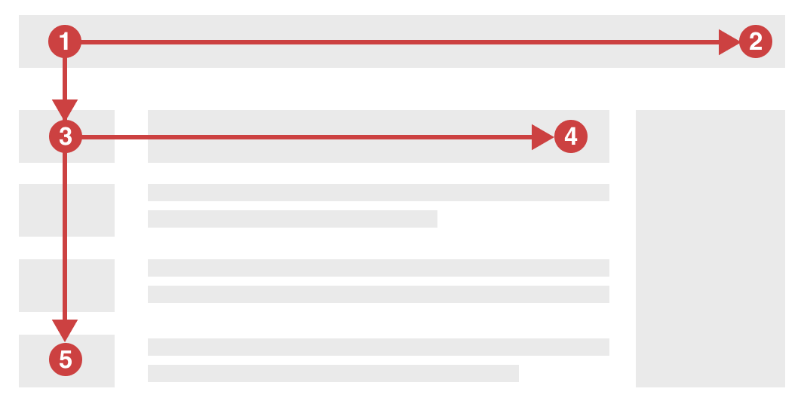

The F-shape is a behavioral pattern describing the way users consume web content. 
Understanding common reading habits is essential for anyone writing content on the web. 
We can intentionally organize information to create friendly products aligned with natural user behavior.

<!--endintro-->

## The F-shaped pattern
The term was popularized in 2006 by the [Nielsen Norman Group](https://www.nngroup.com/). 
These world leaders in user experience research have conducted eye-tracking studies that found: 

1. Users read only the first few lines of content on a page
2. Users skim down the left side of the page primarily

The desire for quick efficiency drives this behaviour. Users seek to avoid the information overload today’s internet throws at them.

::: greybox
Note: The F-shaped pattern is an observation of human behaviour in the age of digital content and media. 
Research has found the F-shape remains surprisingly relevant to native speakers of many languages.
Right-to-left readers use the same pattern, but flipped.
:::

### Applying the principle 
By placing important information along the user’s likely path we can ensure the user’s journey is an easy one. Some simple ways to achieve this include:

-	**No walls of text** (Be concise).
-	**Front-loading** key content (Don’t bury the lead)
-	**Bulleted or numbered lists** are ideal for blocks of content that are still easy to skim
-	**Clear headings** should be succinct and establish an understandable page structure
-	**Simple imagery** is more consumable than text (A picture speaks a thousand words)
-	**Icons aligned to the left** of text allow for quick scanning and pattern recognition (if they’re not overused)

### Secondary reading patterns
The F-shape is the most common way users read content, but other reading patterns exist. Keep in mind these secondary patterns and their respective niches. 

- **Z-shaped pattern** - Where users scan the corners in a zig-zag from top left to bottom right. Typical on pages that are image-based or less text heavy. 
- **Layer-cake pattern** – Where users skim headings and subheadings only, in horizontal lines. Common on dense text-heavy pages.
- **Spotted pattern** – Where user focus jumps between key elements as if looking for something specific (e.g. reading only the hyperlinks on a page).
- **Bypassing pattern** – Where users intentionally skip over the first word(s) of the content. Common when many lines or headings begin with the same words.

Remember, understanding how users interact with content is key. Place important landmarks along the user's natural pathway to facilitate comprehension and engagement.
