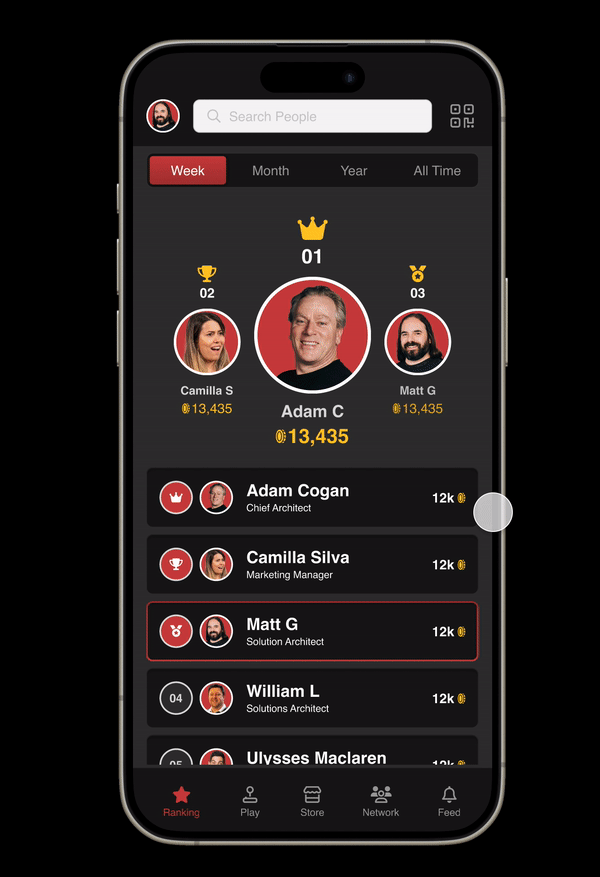
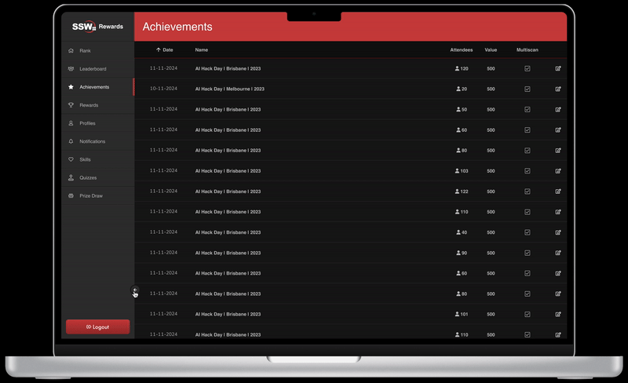
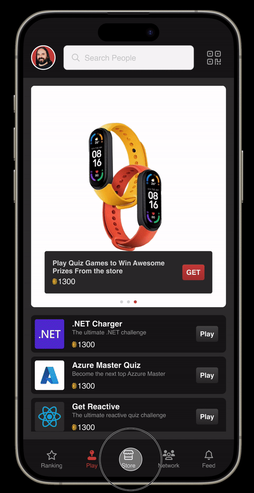

Figma is a powerful design tool that offers several prototyping features that are valuable for UI designers. Here are a few of the top Figma prototyping features:

## Interactive Components:

Figma's Interactive Components feature allows UI designers to easily create dynamic and interactive user interfaces. You can define different states for a component, such as hover or pressed states, and make transitions between these states. This helps simulate how users interact with the final product, providing a more realistic representation of the user experience.

:::good

:::

## Auto Layout:

Auto Layout is a powerful feature in Figma that simplifies the design process for responsive interfaces. When it comes to prototyping, Auto Layout ensures that your designs adapt seamlessly to changes in content or screen size. 

This is crucial for creating prototypes that accurately reflect your UI's behaviour across various devices and screen resolutions.

:::good

:::

## Smart Animate:

Smart Animate is a transition feature in Figma that allows for smooth and automatic animations between frames. It intelligently analyzes changes in layers and properties between frames, creating fluid animations without the need for manual adjustments. This feature is particularly useful for creating realistic transitions between different states of your prototype, enhancing the overall user experience.

:::good

:::

These features, combined with Figma's collaborative capabilities and cloud-based platform, make it a preferred choice for many UI designers for both design and prototyping phases of the product development process.