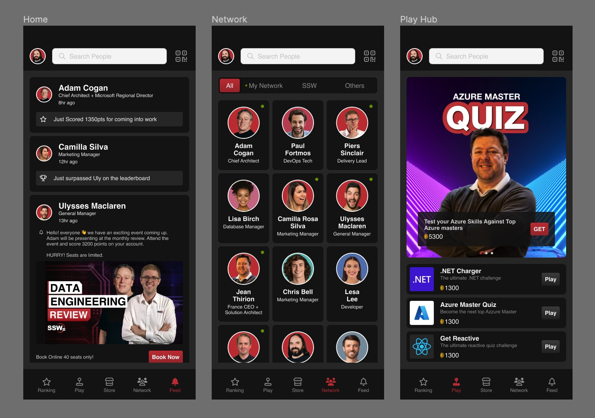
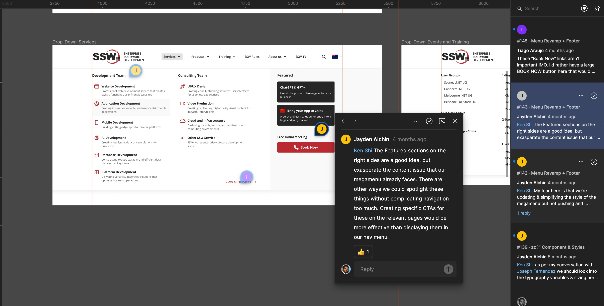
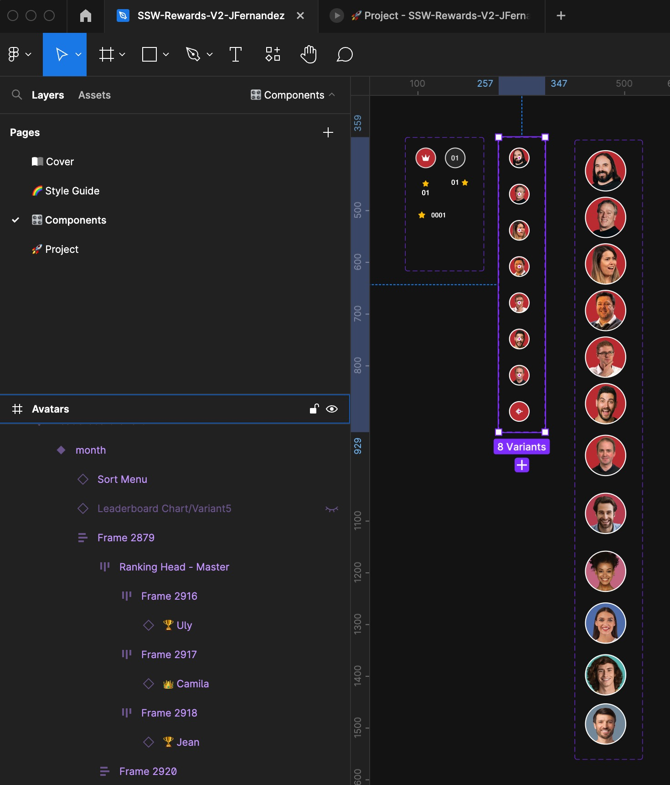
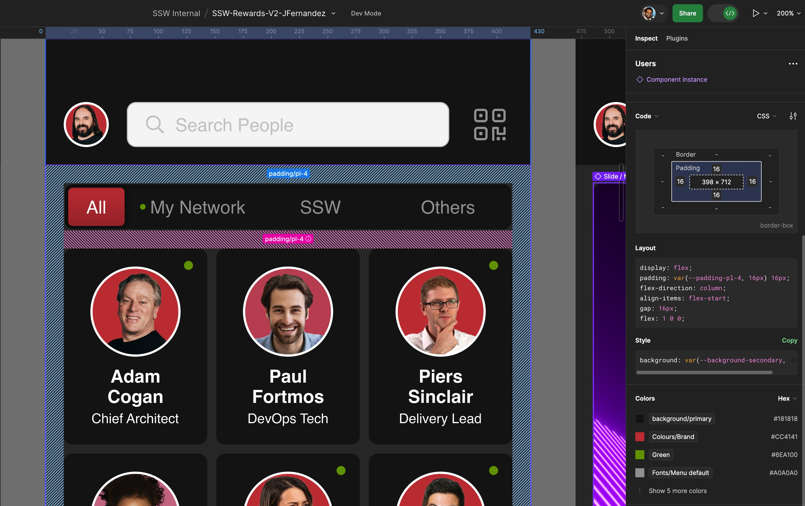

Figma is a cloud-based design and prototyping tool that enables designers, developers, and teams to collaborate in real-time on the same design files. 
`youtube: https://www.youtube.com/embed/PaPIsyO1t3Q?si=WKI5lgm97260OFmD`
**Video: What is Figma? (5 min)**

It's widely used in the design industry for its simplicity, efficiency, and collaborative features. Figma is accessible through a web browser or desktop application, making it easy to work from anywhere.

Top 5 uses of Figma in a development project:

1. **User Interface (UI) Design:** Figma is primarily used for creating UI designs. Its intuitive interface allows designers to craft pixel-perfect layouts, design elements, and visual components for websites, web applications, mobile apps, and other digital products.

   
2. **Prototyping:** With Figma's powerful prototyping features, designers can create interactive prototypes demonstrating their designs' flow and functionality. This helps developers and stakeholders better understand the user experience and interactions before development begins.

   
3. **Collaboration and Feedback:** Figma's real-time collaboration capabilities enable multiple team members to work simultaneously on the same project. This fosters a collaborative environment where designers, developers, and other stakeholders can provide feedback, comment, and iterate on designs.

   

4. **Design Systems:** Figma is popular for building and maintaining design systems. Designers can create reusable components, styles, and libraries, streamlining the design process and ensuring consistency throughout the project.

   
5. **Developer Handoff:** Figma simplifies the handoff process from design to development. Designers can generate design specs, export assets, and provide CSS code snippets to developers. This streamlines the communication between design and development teams, ensuring that the final product matches the intended design.

   

Figma's versatility, real-time collaboration, and design system capabilities make it a valuable tool in the design and development workflow, helping teams create high-quality digital products efficiently.
