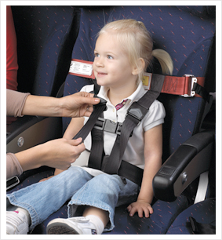

The best way to emphasize your point is to "build" the pain first and then show the solution. So we use "Bad Example" and "Good Example" in the captions where possible.

<!--endintro-->

To do this, we give a bad example and raise users' expectation first.

::: bad  
  
:::

Now we can show the solution and give a good example as the result, make them feel released.

::: good  
  
:::
