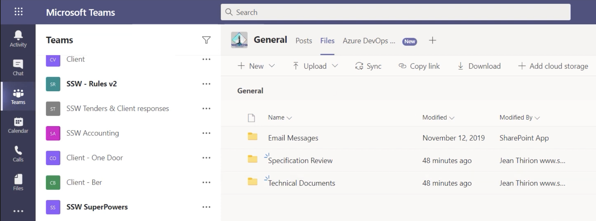
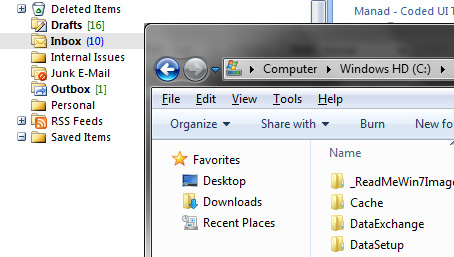

​​​Each client project should have a nice place to keep files. In the old days, things were simple but limited, we simply used Windows Explorer and file shares. Today there are so many places that teams can store documents. E.g Dropbox, OneDrive, SharePoint, Microsoft Teams and Azure DevOps (was TFS). 
<dl class="image"><dt>​​ </dt></dl>
 <excerpt class='endintro'></excerpt> 
<h3 class="ssw15-rteElement-H3">Which is the best corporate solution? </h3>
The solution that allows the best collaboration with Developers, Project Managers, and other stakeholders is SharePoint and Microsoft Teams. It is super easy to create, upload, and share documents with others. 
<dl class="image"><dt>
      
   </dt><dd>Figure: Teams | Team | Files. More at 
      <a href="/_layouts/15/FIXUPREDIRECT.ASPX?WebId=3dfc0e07-e23a-4cbb-aac2-e778b71166a2&TermSetId=07da3ddf-0924-4cd2-a6d4-a4809ae20160&TermId=c34a016c-d126-4e10-859e-4a0bbd2f08a6">https://rules.ssw.com.au/track-project-documents</a>​ </dd></dl><h3 class="ssw15-rteElement-H3">What emails do you need to store?</h3>
More at <a href="/_layouts/15/FIXUPREDIRECT.ASPX?WebId=3dfc0e07-e23a-4cbb-aac2-e778b71166a2&TermSetId=07da3ddf-0924-4cd2-a6d4-a4809ae20160&TermId=aad93e59-5977-466f-8ab5-39b21fbca4dd">Sales - Do you track all sales related activities in CRM?​</a>  

   What stuff do you need to store?​ 

For most projects, you need to quickly store and locate important details and documents such as: 
<ul><li>Server details (Dev, Test, Production) </li><li>Change-log documents </li><li>Upcoming features (most often in Word or OneNote) </li><li>General documents e.g. Requirements/Specifications (Note: it is possible to share documents from Microsoft Teams externally, but not from Teams directly... just open it in ​Office Online or a specific Office app first)​ </li></ul>

<dl class="badImage"><dt> 
       
   </dt><dd>Figure: Bad example – It might be easy to use File Shares, your Local C: or emails – but don’t. They don’t work in a team environment as they aren’t easy for others to access</dd></dl><dl class="badImage"><dt> 
       
   </dt><dd>Figure: Bad example – SharePoint integrated into Azure DevOps (was VSTS/TFS) is not supported via Visual Studio anymore</dd></dl><dl class="badImage"><dt> 
       
   </dt><dd>Figure: Bad example – even though this is using SharePoint - this is using a Team Site with a Document Library - it is better to use Microsoft Teams which uses SharePoint under the covers</dd></dl><dl class="goodImage"><dt> 
       
   </dt><dd>Good example: Use Microsoft Teams and it will automatically create a Site for the Team (and that includes a document library which you can connect to with OneDrive)</dd></dl><h3 class="ssw15-rteElement-H3">What does not get stored in Microsoft Teams?  </h3>
1.	For developers, 
    
<blockquote style="margin:0px 0px 0px 40px;border:none;padding:0px;">
​A: code obviously belongs in GitHub, Azure DevOps, etc.

B: Also the <a href="/_layouts/15/FIXUPREDIRECT.ASPX?WebId=3dfc0e07-e23a-4cbb-aac2-e778b71166a2&TermSetId=07da3ddf-0924-4cd2-a6d4-a4809ae20160&TermId=951ffbf9-4066-42f3-a9b7-e0d8603e728b">7 important documents</a> should be stored in Azure DevOps (was TFS/VSTS).​​.. or instead 
      <a href="/_layouts/15/FIXUPREDIRECT.ASPX?WebId=3dfc0e07-e23a-4cbb-aac2-e778b71166a2&TermSetId=07da3ddf-0924-4cd2-a6d4-a4809ae20160&TermId=846474eb-27a1-4645-90ee-10a349fef714">use Markdown with the Wiki</a>
</blockquote>
2.	For designers with large files, OneDrive is a better choice. See: <a href="/_layouts/15/FIXUPREDIRECT.ASPX?WebId=3dfc0e07-e23a-4cbb-aac2-e778b71166a2&TermSetId=07da3ddf-0924-4cd2-a6d4-a4809ae20160&TermId=2df3378d-f923-4f3f-8c86-ec1074f7f98b">Do you know the best Source Control for Designers?</a> 
<h3>What about usernames and passwords? </h3>
Documents with user names and passwords should not be stored in Microsoft Teams. Security is very important for everyone and every company. Use Azure KeyVault or <a href="http://keepass.info/" target="_blank">KeePass</a> to store usernames and passwords. KeePass keeps all passwords in one database locked by a master key, which should be accessible only by the few people you trust. 

    

<h3 class="ssw15-rteElement-H3">Related rule </h3><ul><li>​<a>Do you integrate Dynamics 365 and Microsoft Teams?</a></li></ul> 

