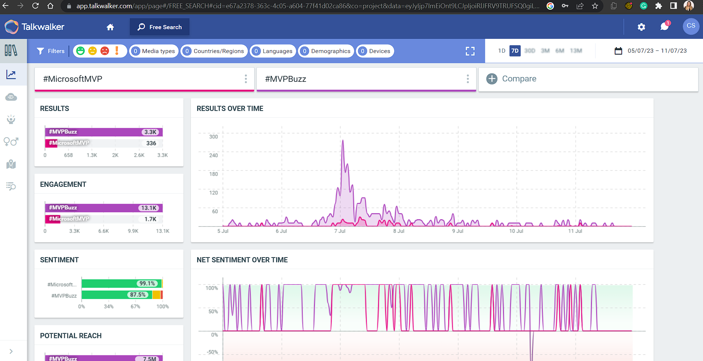

Social media analytics tools like [Talkwalker](https://www.talkwalker.com) revolutionizes hashtag tracking on Twitter, offering valuable insights and data-driven analytics. Unlike manual searches, Talkwalker provides an accurate count of hashtag usage, enabling users to measure trends and understand the magnitude of discussions on specific topics. 

<!--endintro-->

Talkwalker's benefits extend beyond mere hashtag counts. The tool allows users to gain deeper insights into **mentions**, **user engagement**, **geographic distribution**, and **influential users** related to a particular hashtag or event. 

Armed with these valuable data points, businesses, marketers, and researchers can make informed decisions and tailor their strategies to better connect with their audience.

The real-time detailed analytics redefine hashtag tracking, providing a comprehensive approach to understand Twitter trends. With its dynamic graphs and powerful insights, Talkwalker empowers users to stay ahead in the fast-paced world of social media and make informed decisions to enhance their social media presence and engagement.
