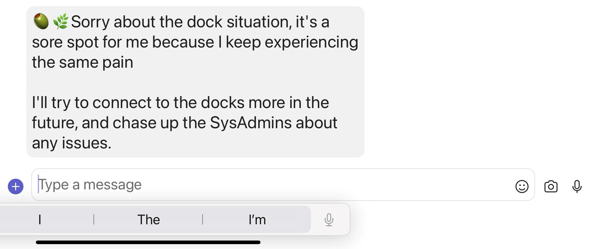

Most people do not like conflict, and so some people may shy away from dealing with a potentially uncomfortable situation, rather than addressing the problem.

When someone brings to your attention that they are not happy with something, it's important to address it so that it doesn't happen again in the future. 

<!--endintro-->

> I am shocked I still have miscommunications with my wife almost everday... something minor seems to pop up, and that's with someone I get along with, understand and have been married to for 20 years.
> 
> Many people speak English as a 2nd language. I believe miscommunications are not limited to the English language... it's a human thing... different experiences, intentions, and expectations will end up with different interpretations of words... so it is more uncommon to have 2 people understand each other perfectly on an issue. If a day goes by without a miscommunication, that would be a shock
> 
> Have ❤️ and patience - Adam Cogan

### Example Scenario - missing a deadline

Consider a scenario where your Product Owner tells you they are unhappy that you missed a deadline, but you thought there were good reasons for missing it. Don't get bogged down in the justification for why it happened. Instead, acknowledge what happened, and drop everything (within reason) to prioritise this work until it's done.

Do not ignore the problem (by continuing business as usual) as it will only escalate, fix it now (by prioritising this work)!

> An issue **ignored** is a 😕 
>
> An issue **actioned** after a reminder is a 👍 
>
> An issue **ignored** after a reminder is a 🚨 - Adam Cogan

### Common Symptoms

Unresolved conflict is bad enough with colleagues, and you can be sure if it's happening with colleagues, it's happening with clients too. Some consequences of unresolved problems with clients are:

* Dissatisfaction and loss of trust
* Cancelled bookings
* Unpaid invoices

If you are getting warning signs such as the above, you need to escalate to your manager ASAP.

### Tips

1. Being chased - If someone has followed you up, get back to them as soon as possible with a response as it shows you care. If you get a second follow up on the same issue, it's generally way more important.
2. Communicating progress - If you are not able to fix the problem immediately, let the person know how long the issue will likely take to fix.
3. [Fix bugs first](https://ssw.com.au/rules/management-do-you-fix-bugs-first/) - they become more expensive and complex over time.
6. [Make client complaints a positive experience](https://ssw.com.au/rules/make-complaints-a-positive-experience/) - retain customer loyalty.
7. Avoid bad blood - If the conflict was unpleasant, it's often a good idea to offer an olive branch after the fact by sending a quick message later on to clear the air. Emojis are a great way to lighten the mood, you could even indicate you're giving them an olive branch e.g. 🫒🌿

::: good

:::

::: good

:::

### When to push back
When you're in the heat of the battle, it is often not the right time to push back. When a team member needs to get something done, you should work as a team to get it done. You can work to resolve any conflict afterwards.

* One-off task - most of the time, if you're unhappy with some work you've been given, but it's a one-off task, don't stress the small stuff, and just get it done.

* Recurring task - however, if it's something you're being asked to do repeatedly, and you're unhappy with it, still do the task, but make sure you clearly communicate any missgivings. Consider sending a "[For the record email](https://ssw.com.au/rules/for-the-record/)"
